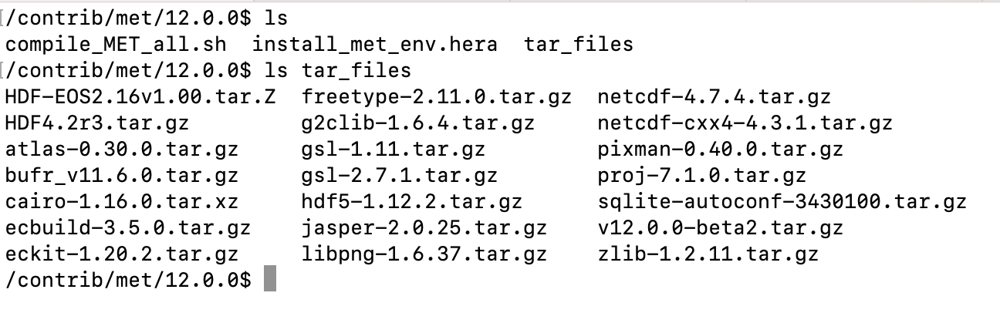
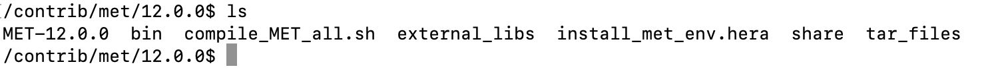

.. _installation:

************
Installation
************

Introduction
============

This section is meant to provide guidance on installing MET. It assumes a
beginner user to MET is compiling MET from scratch and will step through
the installation process, including listing dependent libraries and how
to install them. Installation will require an understanding of the
environment and hardware that MET is being installed on as it has options
that are dependent on compiler usage, modulefiles, etc.

There are multiple supported methods for installing MET: using a provided
compilation script, Docker instances, and Apptainer instances.
All of these methods will be described below. The recommended method is
using the provided
:ref:`compile_script_install`.

Some organizations have access to precompiled versions of MET on
shared systems, making the need for self-installation unnecessary.
Users should check the
`METplus Downloads page <https://dtcenter.org/community-code/metplus/download>`_
for the latest coordinated release’s Existing Builds page for
existing MET installations before continuing.

.. _required_external_libraries_to_build_MET:

Required External Libraries
===========================

MET is dependent on several external libraries to function properly.
The required libraries are listed below:

* `BUFRLIB <https://emc.ncep.noaa.gov/emc/pages/infrastructure/bufrlib.php>`_
  for reading PrepBufr Observation files
* `NetCDF4 <http://www.unidata.ucar.edu/software/netcdf>`_
  in C and CXX, for intermediate and output file formats
* `HDF5 <https://support.hdfgroup.org/ftp/HDF5/releases/hdf5-1.12/hdf5-1.12.2/src/hdf5-1.12.2.tar.gz>`__
  is required to support NetCDF 4. HDF5 should be built with
  `zlib <http://www.zlib.net/>`_
* `GSL <http://www.gnu.org/software/gsl>`_
  GNU Scientific Library Developer's Version for computing
  confidence intervals (use **GSL-1.11** for **PGI** compilers)
* `Proj <https://proj.org/>`_ Library used to instantiate grids within MET

The following libraries are conditionally required, depending on the intended
verification use and compiler language:

* `GRIB2C <https://github.com/NOAA-EMC/NCEPLIBS-g2c>`_
  Library (with dependencies Z, PNG, JASPER), if compiling GRIB2 support
* `Python <https://docs.python.org/3/>`_ Libraries,
  if compiling support for Python embedding
* `ecKit <https://github.com/ecmwf/eckit>`_
  Library, if compiling support for unstructured grids
* `ATLAS <https://math-atlas.sourceforge.net/>`_
  Library, if compiling support for unstructured grids
* `HDF4 <http://www.hdfgroup.org/products/hdf4>`__
  library if compiling the MODIS-Regrid or lidar2nc tool
* `HDF-EOS2 <http://www.hdfeos.org/software/library.php#HDF-EOS2>`__
  library if compiling the MODIS-Regrid or lidar2nc tool
* `Cairo <http://cairographics.org/releases>`_
  library if compiling the MODE-Graphics tool
* `FreeType <http://www.freetype.org/download.html>`_
  library if compiling the MODE-Graphics tool
* `f2c <http://www.netlib.org/f2c>`_
  library for interfacing between Fortran and C
  (**Not required for most compilers**)

Users can take advantage of the compilation script to download and install all of the 
libraries automatically, both required and conditionally required 
:ref:`compile_script_install`.

.. _suggested_external_utiliites:

Suggested External Utilities
============================

The following utilities have been used with success by other METplus users in their verification processes.
They are not required for MET to function, but depending on the user’s intended verification needs, they may be of use:

* `copygb utility <http://www.cpc.ncep.noaa.gov/products/wesley/copygb.html>`_
  for re-gridding GRIB version 1 data
* `wgrib2 utility <https://www.cpc.ncep.noaa.gov/products/wesley/wgrib2/>`_
  for re-gridding GRIB version 2 data  
* `Integrated Data Viewer (IDV) <http://www.unidata.ucar.edu/software/idv>`_
  for displaying gridded data, including GRIB and NetCDF
* `ncview utility <http://meteora.ucsd.edu/~pierce/ncview_home_page.html>`_
  for viewing gridded NetCDF data (e.g. the output of pcp_combine)

.. _compile_script_install:

Using the compile_MET_all.sh script
===================================

The **compile_MET_all.sh** script is designed to install MET and,
if desired, all
of the external library dependencies required for running the system on various
platforms. There are some required environment variables that need to be set
before running the script and some optional environment variables, both of
which are described below. The script relies on a **tar_files.tgz** file, which
contains all of the required and optional library packages for MET but not
MET itself. A separate command will be used to pull down the latest version of
MET in **tar_files.tgz** 
format from GitHub, which the script will then install.

To begin, create and change to a directory where the latest version of MET will be
installed. Assuming that the following guidance uses “/d1” as the parent directory, 
a suggested format is a path to a “met” directory, followed by the version number 
subdirectory (e.g. */d1/met/12.0.0*). 
Next, download the
`compile_MET_all.sh <https://raw.githubusercontent.com/dtcenter/MET/main_v12.0/internal/scripts/installation/compile_MET_all.sh>`_
script and 
`tar_files.tgz <https://dtcenter.ucar.edu/dfiles/code/METplus/MET/installation/tar_files.tgz>`_ 
file and place both of these files in the
new directory. These files are available either
through using the hyperlinks provided or by entering the following commands in
the terminal while in the directory MET will be installed in:

.. code-block:: ini

  wget https://raw.githubusercontent.com/dtcenter/MET/main_v12.0/internal/scripts/installation/compile_MET_all.sh
  wget https://dtcenter.ucar.edu/dfiles/code/METplus/MET/installation/tar_files.tgz

The tar files will need to be extracted in the MET installation directory:

.. code-block:: ini

  tar -zxf tar_files.tgz

To make the compilation script into an executable, change the permissions to the following:

.. code-block:: ini

  chmod 775 compile_MET_all.sh

Now change directories to the one that was created from expanding the tar files:

.. code-block:: ini

  cd tar_files

The next step will be to identify and download the latest MET release as a
tar file (e.g. **v12.0.0.tar.gz**) and place it in
the *tar_files* directory. The file is available from the
MET line under the “RECOMMENDED - COMPONENTS” section on the
`METplus website <https://dtcenter.org/community-code/metplus/download>`_ or
by using a wget command while in the *tar_files* directory:

.. code-block:: ini

  wget https://github.com/dtcenter/MET/archive/refs/tags/v12.0.0.tar.gz

.. _Install_Required-libraries-and:

Environment Variables to Run Script
-----------------------------------

Before running the compilation script, there are five environment variables
that are required: 
**TEST_BASE**, **COMPILER**, **MET_SUBDIR**, **MET_TARBALL**, and **USE_MODULES**.  
If compiling support for Python embedding, the script will need the following
additional environment variables: **MET_PYTHON**, **MET_PYTHON_CC**, and
**MET_PYTHON_LD**. All of these environment variables are discussed
in further detail in the Environment Variable Descriptions section below.
An easy way to set these environment variables is in an environment
configuration file  (for example, **install_met_env.<machine_name>**). An
example environment configuration file to start from (**install_met_env.generic_gnu**),
as well as environment configuration files used on HPCs at NCAR and NOAA,
can be found in the `MET GitHub repository <https://github.com/dtcenter/MET>`_ in the 
`scripts/installation/config <https://github.com/dtcenter/MET/tree/main_v12.0/internal/scripts/installation/config>`_
directory.

Environment Variable Descriptions
---------------------------------

.. dropdown:: REQUIRED

    **TEST_BASE** – Format is */d1/met/12.0.0*. This is the MET
    installation directory that was created 
    the beginning of, :numref:`compile_script_install` and contains the
    **compile_MET_all.sh** script, **tar_files.tgz**, 
    and the *tar_files* directory from the untar command.

    **COMPILER** – Format is *compiler_version* (e.g. gnu_8.3.0). For the GNU family of compilers, 
    use “gnu”; for the Intel family of compilers, use “intel”, "intel-classic", 
    “intel-oneapi”, “ics”, “ips”, or “PrgEnv-intel”, 
    depending on the system. If using an Intel compiler, users that have also 
    set the **USE_MODULES** environment variable to TRUE should review the additional 
    information below for proper configuration file setup. In the past, support was 
    provided for the PGI family of compilers through “pgi”. However, this compiler 
    option is no longer actively tested. 

    **MET_SUBDIR** – Format is */d1/met/12.0.0*. This is the location where the top-level MET 
    subdirectory will
    be installed and is often set equivalent to **TEST_BASE** (e.g. ${TEST_BASE}).

    **MET_TARBALL** – Format is *v12.0.0tar.gz*. This is the name of the downloaded MET tarball.

    **USE_MODULES** – Format is *TRUE* or *FALSE*. Set to FALSE if using a machine that does not use 
    modulefiles; set to TRUE if using a machine that does use modulefiles. For more information on 
    modulefiles, visit the `Wikipedia page <https://en.wikipedia.org/wiki/Environment_Modules_(software)>`_.
    If the **USE_MODULES** setting is set to true and the compiler is an Intel compiler, please 
    review the additional information below for proper configuration file setup.

    **PYTHON_MODULE** -  Format is *PythonModuleName_version* (e.g. python_3.10.4). This environment variable 
    is only required if **USE_MODULES** = TRUE. To set properly, list the Python module to load 
    followed by an underscore and version number. For example, setting
    **PYTHON_MODULE** =python_3.10.4 
    will cause the script to run "module load python/3.10.4".

.. dropdown:: ADDITIONAL SETTINGS FOR INTEL COMPILER USERS WITH THE USE_MODULES SETTING 

    It is necessary for the user to specify (in the install_met_env.<machine> config file) the 
    following environment variables if using the Intel compilers: 

    | For non-oneAPI Intel compilers:
    | export FC=ifort
    | export F77=ifort
    | export F90=ifort
    | export CC=icc
    | export CXX=icpc

    | For oneAPI Intel compilers:
    | export FC=ifx
    | export F77=ifx
    | export F90=ifx
    | export CC=icx
    | export CXX=icpx

    This is due to the machines allowing users to load a module but not setting these environment 
    variables as expected, leading to failed installations. For user convenience, additional 
    generic configuration files have been created that include these settings. Users with a 
    classic Intel compiler are encouraged to use the install_met_env.generic_intel_classic 
    configuration file, and users with a oneAPI Intel compiler should use the 
    install_met_env.generic_intel_oneapi configuration file. 

.. dropdown:: REQUIRED, IF COMPILING PYTHON EMBEDDING

    **MET_PYTHON** – Format is */usr/local/python3*.
    This is the location
    containing the bin, include, lib, and share directories for Python.

    **MET_PYTHON_CC** - Format is -I followed by the directory containing
    the Python include files (e.g. -I/usr/local/python3/include/python3.10).
    This information may be obtained by 
    running :code:`python3-config --cflags`;
    however, this command can, on certain systems, 
    provide too much information.

    **MET_PYTHON_LD** - Format is -L followed by the directory containing
    the Python library 
    files then a space, then -l followed by the necessary Python
    libraries to link to 
    (e.g. -L/usr/local/python3/lib/\\ -lpython3.10\\
    -lpthread\\ -ldl\\ -lutil\\ -lm). 
    The backslashes are necessary in the example shown because of
    the spaces, which will be 
    recognized as the end of the value unless preceded by the “\\”
    character. Alternatively, 
    a user can provide the value in quotations 
    (e.g. export MET_PYTHON_LD="-L/usr/local/python3/lib/
    -lpython3.10 -lpthread -ldl -lutil -lm"). 
    This information may be obtained by running
    :code:`python3-config --ldflags --embed`; however,
    this command can, on certain systems, provide too much information.

.. dropdown:: OPTIONAL

    **export MAKE_ARGS="-j #"** – If there is a need to install external
    libraries, or to attempt 
    to speed up the MET compilation process, this environmental
    setting can be added to the 
    environment configuration file. Replace the # with the number
    of cores to use 
    (as an integer) or simply specify "export MAKE_ARGS=-j"
    with no integer argument to 
    start as many processes in parallel as possible. Note that Docker
    has trouble compiling 
    without a specified value of cores to use.  The automated MET
    testing scripts in the 
    Docker environment have been successful with a value of
    5 (e.g. export MAKE_ARGS=”-j 5”).

    **export MET_CXX_STANDARD** - Specify the version of the supported
    C++ standard. Values may be 11, 14, or 17. The default value is 17.
    (e.g. export MET_CXX_STANDARD=11).

External Library Handling in compile_MET_all.sh
-----------------------------------------------

.. dropdown:: IF THE USER WANTS TO HAVE THE COMPILATION SCRIPT DOWNLOAD THE LIBRARY DEPENDENCIES

    The **compile_MET_all.sh** script will compile and install MET and its
    :ref:`required_external_libraries_to_build_MET`, if needed. 
    Note that if these libraries are already installed somewhere on the system, 
    MET will call and use the libraries that were installed by the script. 

.. dropdown:: IF THE USER ALREADY HAS THE LIBRARY DEPENDENCIES INSTALLED

    If the required external library dependencies have already been installed and don’t 
    need to be reinstalled, or if compiling MET on a machine that uses modulefiles and 
    the user would like to make use of the existing dependent libraries on that machine, 
    there are more environment variables that need to be set to let MET know where those 
    library and header files are. The following environment variables need to be added 
    to the environment configuration file:

    +-------------------+--------------------------------+------------------------------+
    | **Feature**       | **Configuration Option**       | **Environment Variables**    |
    +===================+================================+==============================+
    | *Always*          |                                | MET_BUFRLIB,                 |
    |                   |                                |                              |
    | *Required*        |                                | BUFRLIB_NAME,                |
    |                   |                                |                              |
    |                   |                                | MET_PROJ,                    |
    |                   |                                |                              |
    |                   |                                | MET_HDF5,                    |
    |                   |                                |                              |
    |                   |                                | MET_NETCDF,                  |
    |                   |                                |                              |
    |                   |                                | MET_GSL                      |
    +-------------------+--------------------------------+------------------------------+
    | *Optional*        | :code:`--enable-all` or        | MET_GRIB2CLIB,               |
    |                   |                                |                              |
    | GRIB2             | :code:`--enable-grib2`         | MET_GRIB2CINC,               |        
    |                   |                                |                              |
    | Support           |                                | GRIB2CLIB_NAME,              |
    |                   |                                |                              |
    |                   |                                | LIB_JASPER,                  |
    |                   |                                |                              |
    |                   |                                | LIB_PNG,                     |
    |                   |                                |                              |
    |                   |                                | LIB_Z                        |
    +-------------------+--------------------------------+------------------------------+
    | *Optional*        | :code:`--enable-all` or        | MET_PYTHON_BIN_EXE,          |
    |                   |                                |                              |
    | Python            | :code:`--enable-python`        | MET_PYTHON_CC,               |
    |                   |                                |                              |
    | Support           |                                | MET_PYTHON_LD                |
    +-------------------+--------------------------------+------------------------------+
    | *Optional*        | :code:`--enable-all` or        | MET_ATLAS,                   |
    |                   |                                |                              |
    | Unstructured Grid | :code:`--enable-ugrid`         | MET_ECKIT                    |
    |                   |                                |                              |
    | Support           |                                |                              |
    +-------------------+--------------------------------+------------------------------+
    | *Optional*        | :code:`--enable-all` or        | MET_HDF                      |
    |                   |                                |                              |
    | LIDAR2NC          | :code:`--enable-lidar2nc`      |                              |
    |                   |                                |                              |
    | Support           |                                |                              |
    +-------------------+--------------------------------+------------------------------+
    | *Optional*        | :code:`--enable-all` or        | MET_HDF,                     |
    |                   |                                |                              |
    | MODIS             | :code:`--enable-modis`         | MET_HDFEOS                   |
    |                   |                                |                              |
    | Support           |                                |                              |
    +-------------------+--------------------------------+------------------------------+
    | *Optional*        | :code:`--enable-all` or        | MET_CAIRO,                   |
    |                   |                                |                              |
    | MODE Graphics     | :code:`--enable-mode_graphics` | MET_FREETYPE                 |
    |                   |                                |                              |
    | Support           |                                |                              |
    +-------------------+--------------------------------+------------------------------+
  	  
    Generally speaking, for each library there is a set of three
    environment variables that can  
    describe the locations: 
    **$MET_<lib>**, **$MET_<lib>INC** and **$MET_<lib>LIB**.

    The $MET_<lib> environment variable can be used if the external library is 
    installed such that there is a main directory which has a subdirectory called 
    *lib* containing the library files and another subdirectory called *include*
    containing the include files.

    Alternatively, the $MET_<lib>INC and $MET_<lib>LIB environment variables are used if the 
    library and include files for an external library are installed in separate locations. 
    In this case, both environment variables must be specified and the associated 
    $MET_<lib> variable will be ignored.

.. dropdown:: FINAL NOTE ON EXTERNAL LIBRARIES

    For users wishing to run the Plot-MODE-Field tool, the Ghostscript 
    `font data <http://sourceforge.net/projects/gs-fonts>`_ must be 
    downloaded and the **MET_FONT_DIR** environment variable in the 
    **install_met_env.<machine_name>** file should point to the directory containing those fonts.

Executing the compile_MET_all.sh script
---------------------------------------

With the proper files downloaded and the environment configuration file set to the 
particular system’s needs, MET is ready for installation. The screenshot below shows the 
contents of the installation directory followed by the tar_files subdirectory at 
this step on the machine ‘hera’.

Simply enter the following into the terminal to execute the script:

.. code-block:: ini

  ./compile_MET_all.sh install_met_env.<machine_name>

The screenshot below shows the contents of the installation directory after installation:

To confirm that MET was installed successfully, run the following command from the installation directory to check for errors in the test file:

.. code-block:: ini
		
  grep -i error MET12.0.0/met.make_test.log
  
If no errors are returned, the installation was successful.
Due to the highly variable nature of hardware systems, users may encounter issues during 
the installation process that result in MET not being installed. If this occurs please 
first recheck that the location of all the necessary data files and scripts is correct. 
Next, recheck the environment variables in the environment configuration file and 
ensure there are no spelling errors or improperly set variables. 
After these checks are complete, run the script again.

If there are still errors, users still have options to obtain a successful 
MET installation. Check the `FAQ section of the User’s Guide on topics relevant to installation <https://met.readthedocs.io/en/latest/Users_Guide/appendixA.html#met-won-t-compile>`_. 
Next, review previously asked questions on the installation topic in 
`GitHub Discussions <https://github.com/dtcenter/METplus/discussions/categories/installation>`_. 
Users are welcome to post any questions they might have that have not been asked. 
Finally, consider one of the remaining installation methods for MET, 
as these may prove more successful.

Using Docker for Running MET
============================

Docker is a system that seeks to eliminate some of the complexities associated with 
downloading various software and any library dependencies it might have by allowing 
users to run inside a preset container. Instead of using a hard copy of an application, 
Docker allows users to pull images of the application and run those within the 
Docker environment. This is beneficial to both developers (who no longer have to 
design with every possible system environment in mind) and users (who can skip tracking 
down system environment settings and meet with success faster) alike.

MET has numerous version images for Docker users and continues to be released as 
images at the same interval as system releases. While the advantages of Docker can 
make it an appealing installation route for first time users, it does require 
privileged user access that will result in an unsuccessful installation if not 
available. Please ensure the user has high system access
(e.g. admin access) before attempting this method.

Installing Docker
-----------------

To begin, download and install the correct version of Docker for the
intended system.
`The Docker installation webpage <https://www.docker.com/products/overview>`_
should detect what
system is accessing the webpage and auto select the appropriate
version. If a different version is required, select the correct
version from the dropdown option. Follow Docker’s instructions
for a successful installation.

Loading the Latest Docker Image of MET
--------------------------------------

Once the installation of Docker has been confirmed to be successful,
all that’s needed to run MET is to download the latest image of MET
in Docker. To accomplish that, use the pull command, with the latest
MET version number, for example:

.. code-block:: ini

  docker pull dtcenter/met:12.0.0

Omitting the
version number will result in an error due to Docker’s behavior
of attempting to retrieve an image with the “latest” tag, which
MET no longer uses. 

Running the Docker version of MET
---------------------------------

All that is left to do is launch a shell in the Docker container. 
This is accomplished with the command:

.. code-block:: ini

  docker run -it --rm dtcenter/met /bin/bash

Note that the "--rm" command was added to automatically remove the
container created 
from the image once exiting Docker. Simply remove this command if the 
container should persist after exiting. If there is an error
during this run command, try adding the latest MET version number
the same way the latest image of MET was pulled:

.. code-block:: ini

  docker run -it --rm dtcenter/met:12.0.0 /bin/bash 
  
If the  usage MET via Docker images was successful, it is highly
recommended to move on 
to using the METplus wrappers of the tools, which have their own
Docker image. 
Instructions for obtaining that image are in the 
`METplus Wrappers User's Guide <https://metplus.readthedocs.io/en/latest/Users_Guide/getting_started.html#metplus-in-docker>`_.

Using Apptainer for Running MET
===============================

Similar to Docker, Apptainer (formerly Singularity) removes some of the
complexities associated with downloading various library dependencies and
runs inside a preset container. Apptainer is incredibly flexible and was
designed to function on High Performance Computing (HPC) systems. It can
utilize Container Library and Docker images, meaning users can benefit
from the Docker images that already exist for MET. 

Perhaps the biggest benefit of using Apptainer (aside from its agnostic
platform availability) is its nonrequirement of root permissions. This can
be one of the only ways users operating on large-scale, shared computing
resources can access MET. That, plus the relatively simple installation of
Apptainer and retrieval of Docker images, should help any users experiencing
difficulties with MET installation using previous methods achieve success.

Installing Apptainer
--------------------

To begin, download and install the correct version of Apptainer for the
intended system. The method of installing from code is outlined in
`Apptainer’s INSTALL.md file <https://github.com/apptainer/apptainer/blob/main/INSTALL.md>`_
on their GitHub page. If users require an alternate method to
install Apptainer, the
`Admin guide <https://apptainer.org/docs/admin/main/installation.html>`_
will provide further details.

Loading the Latest MET Image
----------------------------

Similar to Docker, Apptainer will build the container based off of the
MET image in a single command. To accomplish this, Apptainer’s
“Swiss army knife”  :code:`build`
command is used. Use the the latest MET version number in
conjunction with :code:`build`
to make the container:

.. code-block:: ini

  singularity build met-12.0.0.sif docker://dtcenter/met:12.0.0

Running the MET Container
-------------------------

The container is now ready for usage! Simply use the :code:`exec`
command to invoke the MET container, along with the appropriate
MET command line usage:

.. code-block:: ini

  singularity exec met-12.0.0.sif plot_data_plane /home/data/fcst_006.grb2 image_output.ps ‘name=”TMP”; level=”Z0”;’

Stopping the Apptainer Instance
-------------------------------

Once work is complete within the instance, the :code:`stop`
command can be used to end the instance. This command will need to
be used otherwise the instance will continue to run in the background:

.. code-block:: ini

    singularity instance stop /path/to/container/met-12.0.0.sif met-12.0.0  

Now that MET is successfully installed, it is highly recommended to
next install the METplus wrappers to take full advantage of
`Python integration <https://metplus.readthedocs.io/en/latest/Users_Guide/installation.html>`_.
Users can also proceed to the
`Tutorial <https://dtcenter.org/community-code/metplus/online-tutorial>`_
and run through the examples that only utilize the MET processes
(METplus wrapper applications and commands will not work unless
METplus wrappers are also installed).

