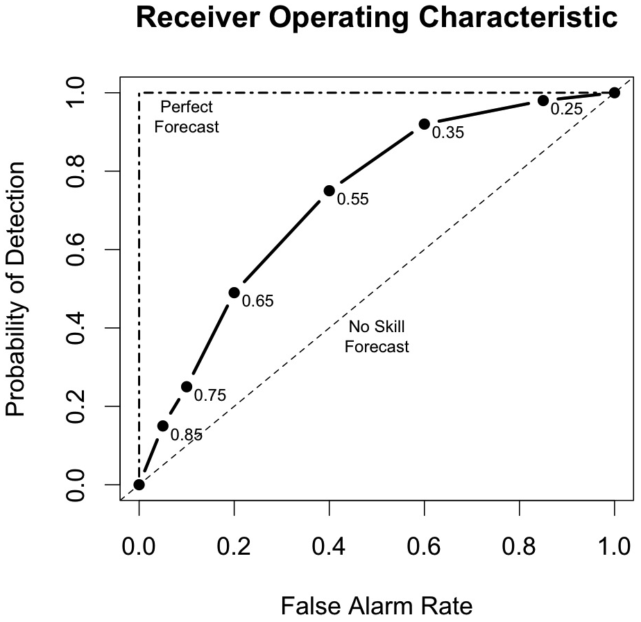

.. _appendixC:

Appendix C Verification Measures
================================

This appendix provides specific information about the many verification statistics and measures that are computed by MET. These measures are categorized into measures for categorical (dichotomous) variables; measures for continuous variables; measures for probabilistic forecasts and measures for neighborhood methods. While the continuous, categorical, and probabilistic statistics are computed by both the Point-Stat and Grid-Stat tools, the neighborhood verification measures are only provided by the Grid-Stat tool.

Which statistics are the same, but with different names?
________________________________________________________

.. list-table:: Statistics in MET and other names they have been published under.
  :widths: auto
  :header-rows: 1

  * - Statistics in MET
    - Other names for the same statistic
  * - Probability of Detection
    - Hit Rate
  * - Probability of False Detection
    - False Alarm Rate (not Ratio)
  * - Critical Success Index
    - Threat Score
  * - Gilbert Skill Score
    - Equitable Threat Score
  * - Hanssen and Kuipers Discriminant
    - True Skill Statistic, Pierce's Skill Score
  * - Heidke Skill Score
    - Cohen's K
  * - Odds Ratio Skill Score
    - Yule's Q
  * - Mean Error
    - Magnitude Bias
  * - Mean Error Squared (ME2)
    - MSE by Mean Difference
  * - Bias Corrected MSE
    - MSE by Pattern Variation
  * - MSESS
    - Murphy's MSESS
  * - Pearson Correlation
    - Anomalous Pattern Correlation
  * - Anomaly Correlation
    - Anomalous Correction
  * - Rank Histogram
    - Talagrand Diagram
  * - Reliability Diagram
    - Attributes Diagram
  * - Ignorance Score
    - Logarithmic Scoring Rule

.. _categorical variables:

MET verification measures for categorical (dichotomous) variables
_________________________________________________________________

The verification statistics for dichotomous variables are formulated using a contingency table such as the one shown in :numref:`table_2X2`. In this table f represents the forecasts and o represents the observations; the two possible forecast and observation values are represented by the values 0 and 1. The values in :numref:`table_2X2` are counts of the number of occurrences of the four possible combinations of forecasts and observations. 

.. _table_2X2:

.. list-table:: 2x2 contingency table in terms of counts. The :math:`\mathbf{n}_\mathbf{ij}` values in the table represent the counts in each forecast-observation category, where :math:`\mathbf{i}` represents the forecast and :math:`\mathbf{j}` represents the observations. The "." symbols in the total cells represent sums across categories.
  :widths: auto
  :header-rows: 2

  * - Forecast
    - Observation
    -
    - Total
  * -
    - o = 1 (e.g., "Yes")
    - o = 0 (e.g., "No")
    -
  * - f = 1 (e.g., "Yes")
    - :math:`\mathbf{n}_{11}`
    - :math:`\mathbf{n}_{10}`
    - :math:`\mathbf{n}_{1.} = \mathbf{n}_{11} + \mathbf{n}_{10}`
  * - f = 0 (e.g., "No")
    - :math:`\mathbf{n}_{01}`
    - :math:`\mathbf{n}_{00}`
    - :math:`\mathbf{n}_{0.} = \mathbf{n}_{01} + \mathbf{n}_{00}`
  * - Total
    - :math:`\mathbf{n}_{.1} = \mathbf{n}_{11} + \mathbf{n}_{01}`
    - :math:`\mathbf{n}_{.0} = \mathbf{n}_{10} + \mathbf{n}_{00}`
    - :math:`T = \mathbf{n}_{11} + \mathbf{n}_{10} + \mathbf{n}_{01} + \mathbf{n}_{00}`

The counts, :math:`n_{11}, n_{10}, n_{01}, \text{and } n_{00},` are sometimes called the "Hits", "False alarms", "Misses", and "Correct rejections", respectively. 

By dividing the counts in the cells by the overall total, T, the joint proportions, :math:`\mathbf{p}_{11}, \mathbf{p}_{10}, \mathbf{p}_{01}, \text{and } \mathbf{p}_{00}` can be computed. Note that :math:`\mathbf{p}_{11} + \mathbf{p}_{10} + \mathbf{p}_{01} + \mathbf{p}_{00} = 1.` Similarly, if the counts are divided by the row (column) totals, conditional proportions, based on the forecasts (observations) can be computed. All of these combinations and the basic counts can be produced by the Point-Stat tool.

The values in :numref:`table_2X2` can also be used to compute the F, O, and H relative frequencies that are produced by the NCEP Verification System, and the Point-Stat tool provides an option to produce the statistics in this form. In terms of the other statistics computed by the Point-Stat tool, F is equivalent to the Mean Forecast; H is equivalent to POD; and O is equivalent to the Base Rate. All of these statistics are defined in the subsections below. The Point-Stat tool also provides the total number of observations, **T**.

The categorical verification measures produced by the Point-Stat and Grid-Stat tools are described in the following subsections. They are presented in the order shown in :numref:`table_PS_format_info_FHO` through :numref:`table_PS_format_info_CTS_cont`.

TOTAL
~~~~~

The total number of forecast-observation pairs, **T**.

Base rate
~~~~~~~~~

Called "O_RATE" in FHO output :numref:`table_PS_format_info_FHO`

Called "BASER" in CTS output :numref:`table_PS_format_info_CTS`

The base rate is defined as :math:`\bar{o} = \frac{n_{11} + n_{01}}{T} = \frac{n_{.1}}{T}.` This value is also known as the sample climatology, and is the relative frequency of occurrence of the event (i.e., o = 1). The base rate is equivalent to the "O" value produced by the NCEP Verification System.

Mean forecast
~~~~~~~~~~~~~

Called "F_RATE" in FHO output :numref:`table_PS_format_info_FHO`

Called "FMEAN" in CTS output :numref:`table_PS_format_info_CTS`

The mean forecast value is defined as :math:`\bar{f} = \frac{n_{11} + n_{10}}{T} = \frac{n_{1.}}{T}.`

This statistic is comparable to the base rate and is the relative frequency of occurrence of a forecast of the event (i.e., **f = 1**). The mean forecast is equivalent to the "F" value computed by the NCEP Verification System.

Accuracy
~~~~~~~~

Called "ACC" in CTS output :numref:`table_PS_format_info_CTS`

Accuracy for a 2x2 contingency table is defined as 

.. math:: \text{ACC } = \frac{n_{11} + n_{00}}{T}.

That is, it is the proportion of forecasts that were either hits or correct rejections - the fraction that were correct. Accuracy ranges from 0 to 1; a perfect forecast would have an accuracy value of 1. Accuracy should be used with caution, especially for rare events, because it can be strongly influenced by large values of :math:`\mathbf{n_{00}}`.

Frequency Bias
~~~~~~~~~~~~~~

Called "FBIAS" in CTS output :numref:`table_PS_format_info_CTS`

Frequency Bias is the ratio of the total number of forecasts of an event to the total number of observations of the event. It is defined as

.. math:: \text{Bias } = \frac{n_{11} + n_{10}}{n_{11} + n_{01}} = \frac{n_{1.}}{n_1}.

A "good" value of Frequency Bias is close to 1; a value greater than 1 indicates the event was forecasted too frequently and a value less than 1 indicates the event was not forecasted frequently enough.

Probability of Detection (POD)
~~~~~~~~~~~~~~~~~~~~~~~~~~~~~~

Called "H_RATE" in FHO output :numref:`table_PS_format_info_FHO`

Called "PODY" in CTS output :numref:`table_PS_format_info_CTS`

POD is defined as 

.. math:: \text{POD } = \frac{n_{11}}{n_{11} + n_{01}} = \frac{n_{11}}{n_1}.

It is the fraction of events that were correctly forecasted to occur. POD is equivalent to the H value computed by the NCEP verification system and is also known as the hit rate. POD ranges from 0 to 1; a perfect forecast would have POD = 1.

Probability of False Detection (POFD)
~~~~~~~~~~~~~~~~~~~~~~~~~~~~~~~~~~~~~

Called "POFD" in CTS output :numref:`table_PS_format_info_CTS`

POFD is defined as 

.. math:: \text{POFD } = \frac{n_{10}}{n_{10} + n_{00}} = \frac{n_{10}}{n_{.0}}.

It is the proportion of non-events that were forecast to be events. POFD is also often called the False Alarm Rate. POFD ranges from 0 to 1; a perfect forecast would have POFD = 0.

Probability of Detection of the non-event (PODn)
~~~~~~~~~~~~~~~~~~~~~~~~~~~~~~~~~~~~~~~~~~~~~~~~

Called "PODN" in CTS output :numref:`table_PS_format_info_CTS`

PODn is defined as 

.. math:: \text{PODN } = \frac{n_{00}}{n_{10} + n_{00}} = \frac{n_{00}}{n_{.0}}.

It is the proportion of non-events that were correctly forecasted to be non-events. Note that PODn = 1 - POFD. PODn ranges from 0 to 1. Like POD, a perfect forecast would have PODn = 1.

False Alarm Ratio (FAR)
~~~~~~~~~~~~~~~~~~~~~~~

Called "FAR" in CTS output :numref:`table_PS_format_info_CTS`

FAR is defined as 

.. math:: \text{FAR } = \frac{n_{10}}{n_{10} + n_{11}} = \frac{n_{10}}{n_{1.}}.

It is the proportion of forecasts of the event occurring for which the event did not occur. FAR ranges from 0 to 1; a perfect forecast would have FAR = 0.

Critical Success Index (CSI)
~~~~~~~~~~~~~~~~~~~~~~~~~~~~

Called "CSI" in CTS output :numref:`table_PS_format_info_CTS`

CSI is defined as 

.. math:: \text{CSI } = \frac{n_{11}}{n_{11} + n_{10} + n_{01}}.

It is the ratio of the number of times the event was correctly forecasted to occur to the number of times it was either forecasted or occurred. CSI ignores the "correct rejections" category (i.e., :math:`\mathbf{n_{00}}`). CSI is also known as the Threat Score (TS). CSI can also be written as a nonlinear combination of POD and FAR, and is strongly related to Frequency Bias and the Base Rate.

Gilbert Skill Score (GSS)
~~~~~~~~~~~~~~~~~~~~~~~~~

Called "GSS" in CTS output :numref:`table_PS_format_info_CTS`

GSS is based on the CSI, corrected for the number of hits that would be expected by chance. In particular, 

.. math:: \text{GSS } = \frac{n_{11} - C_1}{n_{11} + n_{10} + n_{01} - C_1},

where

.. math:: C = \frac{(n_{11} + n_{10}) (n_{11} + n_{01})}{T}.

GSS is also known as the Equitable Threat Score (ETS). GSS values range from -1/3 to 1. A no-skill forecast would have GSS = 0; a perfect forecast would have GSS = 1.

Hanssen-Kuipers Discriminant (HK)
~~~~~~~~~~~~~~~~~~~~~~~~~~~~~~~~~~

Called "HK" in CTS output :numref:`table_PS_format_info_CTS`

HK is defined as 

.. math:: \text{HK } = \frac{n_{11} n_{00} - n_{10} n_{01}}{(n_{11} + n_{01}) (n_{10} + n_{00})}.

More simply, HK = POD :math:`-` POFD.

HK is also known as the True Skill Statistic (TSS) and less commonly (although perhaps more properly) as the Peirce Skill Score. HK measures the ability of the forecast to discriminate between (or correctly classify) events and non-events. HK values range between -1 and 1. A value of 0 indicates no skill; a perfect forecast would have HK = 1.

Heidke Skill Score (HSS)
~~~~~~~~~~~~~~~~~~~~~~~~

Called "HSS" in CTS output :numref:`table_PS_format_info_CTS`

HSS is a skill score based on Accuracy, where the Accuracy is corrected by the number of correct forecasts that would be expected by chance. In particular, 

.. math:: \text{HSS } = \frac{n_{11} + n_{00} - C_2}{T - C_2},

where

.. math:: C_2 = \frac{(n_{11} + n_{10}) (n_{11} + n_{01}) + (n_{01} + n_{00}) (n_{10} + n_{00})}{T}.

HSS can range from minus infinity to 1. A perfect forecast would have HSS = 1.

Odds Ratio (OR)
~~~~~~~~~~~~~~~

Called "ODDS" in CTS output :numref:`table_PS_format_info_CTS`

OR measures the ratio of the odds of a forecast of the event being correct to the odds of a forecast of the event being wrong. OR is defined as 

.. math:: \text{OR } = \frac{n_{11} \times n_{00}}{n_{10} \times n_{01}} = \frac{(\frac{\text{POD}}{1 - \text{POD}})}{(\frac{\text{POFD}}{1 - \text{POFD}})}.

OR can range from 0 to :math:`\infty`. A perfect forecast would have a value of OR = infinity. OR is often expressed as the log Odds Ratio or as the Odds Ratio Skill Score (:ref:`Stephenson 2000 <Stephenson-2000>`).

Logarithm of the Odds Ratio (LODDS)
~~~~~~~~~~~~~~~~~~~~~~~~~~~~~~~~~~~

Called "LODDS" in CTS output :numref:`table_PS_format_info_CTS`

LODDS transforms the odds ratio via the logarithm, which tends to normalize the statistic for rare events (:ref:`Stephenson 2000 <Stephenson-2000>`). However, it can take values of :math:`\pm\infty` when any of the contingency table counts is 0. LODDS is defined as :math:`\text{LODDS} = ln(OR)`.

Odds Ratio Skill Score (ORSS)
~~~~~~~~~~~~~~~~~~~~~~~~~~~~~

Called "ORSS" in CTS output :numref:`table_PS_format_info_CTS`

ORSS is a skill score based on the odds ratio. ORSS is defined as 

.. math:: \text{ORSS } = \frac{OR - 1}{OR + 1}.

ORSS is sometimes also referred to as Yule's Q. (:ref:`Stephenson 2000 <Stephenson-2000>`).

Extreme Dependency Score (EDS)
~~~~~~~~~~~~~~~~~~~~~~~~~~~~~~

Called "EDS" in CTS output :numref:`table_PS_format_info_CTS`

The extreme dependency score measures the association between forecast and observed rare events. EDS is defined as

.. math:: \text{EDS } = \frac{2 ln(\frac{n_{11} + n_{01}}{T})}{ln(\frac{n_{11}}{T})} - 1.

EDS can range from -1 to 1, with 0 representing no skill. A perfect forecast would have a value of EDS = 1. EDS is independent of bias, so should be presented along with the frequency bias statistic (:ref:`Stephenson et al, 2008 <Stephenson-2008>`).

Extreme Dependency Index (EDI)
~~~~~~~~~~~~~~~~~~~~~~~~~~~~~~

Called "EDI" in CTS output :numref:`table_PS_format_info_CTS`

The extreme dependency index measures the association between forecast and observed rare events. EDI is defined as

.. math:: \text{EDI } = \frac{\log F - \log H}{\log F + \log H},

where *H* and *F* are the Hit Rate and False Alarm Rate, respectively. 

EDI can range from :math:`-\infty` to 1, with 0 representing no skill. A perfect forecast would have a value of EDI = 1 (:ref:`Ferro and Stephenson, 2011 <Stephenson-2008>`).

Symmetric Extreme Dependency Score (SEDS)
~~~~~~~~~~~~~~~~~~~~~~~~~~~~~~~~~~~~~~~~~

Called "SEDS" in CTS output :numref:`table_PS_format_info_CTS`

The symmetric extreme dependency score measures the association between forecast and observed rare events. SEDS is defined as 

.. math:: \text{SEDS } = \frac{2 \ln [\frac{(n_{11} + n_{01}) (n_{11} + n_{10})}{T^2}]}{\ln (\frac{n_{11}}{T})} - 1.

SEDS can range from :math:`-\infty` to 1, with 0 representing no skill. A perfect forecast would have a value of SEDS = 1 (:ref:`Ferro and Stephenson, 2011 <Stephenson-2008>`).

Symmetric Extremal Dependency Index (SEDI)
~~~~~~~~~~~~~~~~~~~~~~~~~~~~~~~~~~~~~~~~~~

Called "SEDI" in CTS output :numref:`table_PS_format_info_CTS`

The symmetric extremal dependency index measures the association between forecast and observed rare events. SEDI is defined as 

.. math:: \text{SEDI } = \frac{\ln F - \ln H + \ln (1 - H) - \ln (1 - F)}{\ln F + \ln H + \ln (1 - H) + \ln (1 - F)}, 

where :math:`H = \frac{n_{11}}{n_{11} + n_{01}}` and :math:`F = \frac{n_{10}}{n_{00} + n_{10}}` are the Hit Rate and False Alarm Rate, respectively. 

SEDI can range from :math:`-\infty` to 1, with 0 representing no skill. A perfect forecast would have a value of SEDI = 1. SEDI approaches 1 only as the forecast approaches perfection (:ref:`Ferro and Stephenson, 2011 <Stephenson-2008>`).

Bias Adjusted Gilbert Skill Score (GSS)
~~~~~~~~~~~~~~~~~~~~~~~~~~~~~~~~~~~~~~~

Called "BAGSS" in CTS output :numref:`table_PS_format_info_CTS`

BAGSS is based on the GSS, but is corrected as much as possible for forecast bias (:ref:`Brill and Mesinger, 2009<Brill-2009>`).

Economic Cost Loss Relative Value (ECLV)
~~~~~~~~~~~~~~~~~~~~~~~~~~~~~~~~~~~~~~~~

Included in ECLV output :numref:`table_PS_format_info_ECLV`

The Economic Cost Loss Relative Value (ECLV) applies a weighting to the contingency table counts to determine the relative value of a forecast based on user-specific information. The cost is incurred to protect against an undesirable outcome, whether that outcome occurs or not. No cost is incurred if no protection is undertaken. Then, if the event occurs, the user sustains a loss. If the event does not occur, there is neither a cost nor a loss. The maximum forecast value is achieved when the cost/loss ratio equals the climatological probability. When this occurs, the ECLV is equal to the Hanssen and Kuipers discriminant. The Economic Cost Loss Relative Value is defined differently depending on whether the cost / loss ratio is lower than the base rate or higher. The ECLV is a function of the cost / loss ratio (cl), the hit rate (h), the false alarm rate (f), the miss rate (m), and the base rate (b).

For cost / loss ratio below the base rate, the ECLV is defined as: 

.. math:: \text{ECLV } = \frac{(cl \ast (h + f - 1)) + m}{cl \ast (b - 1)}.

For cost / loss ratio above the base rate, the ECLV is defined as: 

.. math:: \text{ECLV } = \frac{(cl \ast (h + f)) + m - b}{b \ast (cl - 1)}.

MET verification measures for continuous variables
__________________________________________________

For continuous variables, many verification measures are based on the forecast error (i.e., **f - o**). However, it also is of interest to investigate characteristics of the forecasts, and the observations, as well as their relationship. These concepts are consistent with the general framework for verification outlined by :ref:`Murphy and Winkler (1987) <Murphy-1987>`. The statistics produced by MET for continuous forecasts represent this philosophy of verification, which focuses on a variety of aspects of performance rather than a single measure.

The verification measures currently evaluated by the Point-Stat tool are defined and described in the subsections below. In these definitions, **f** represents the forecasts, **o** represents the observation, and **n** is the number of forecast-observation pairs.

Mean forecast
~~~~~~~~~~~~~

Called "FBAR" in CNT output :numref:`table_PS_format_info_CNT`

Called "FBAR" in SL1L2 output :numref:`table_PS_format_info_SL1L2`

The sample mean forecast, FBAR, is defined as :math:`\bar{f} = \frac{1}{n} \sum_{i=1}^{n} f_i`.

Mean observation
~~~~~~~~~~~~~~~~

Called "OBAR" in CNT output :numref:`table_PS_format_info_CNT`

Called "OBAR" in SL1L2 output :numref:`table_PS_format_info_SL1L2`

The sample mean observation is defined as :math:`\bar{o} = \frac{1}{n} \sum_{i=1}^{n} o_i`.

Forecast standard deviation
~~~~~~~~~~~~~~~~~~~~~~~~~~~

Called "FSTDEV" in CNT output :numref:`table_PS_format_info_CNT`

The sample variance of the forecasts is defined as 

.. math:: s_f^2 = \frac{1}{T - 1} \sum_{i=1}^T (f_i - \bar{f})^2 .

The forecast standard deviation is defined as :math:`s_f = \sqrt{s_f^2}`.

Observation standard deviation
~~~~~~~~~~~~~~~~~~~~~~~~~~~~~~

Called "OSTDEV" in CNT output :numref:`table_PS_format_info_CNT`

The sample variance of the observations is defined as 

.. math:: s_o^2 = \frac{1}{T-1} \sum_{i=1}^T (o_i - \bar{o})^2 .

The observed standard deviation is defined as :math:`s_o = \sqrt{s_o^2}`.

Pearson Correlation Coefficient
~~~~~~~~~~~~~~~~~~~~~~~~~~~~~~~

Called "PR_CORR" in CNT output :numref:`table_PS_format_info_CNT`

The Pearson correlation coefficient, **r**, measures the strength of linear association between the forecasts and observations. The Pearson correlation coefficient is defined as: 

.. math:: r = \frac{\sum_{i=1}^T (f_i - \bar{f})(o_i - \bar{o})}{\sqrt{\sum(f_i - \bar{f})^2} \sqrt{\sum(o_i - \bar{o})^2 }}

**r** can range between -1 and 1; a value of 1 indicates perfect correlation and a value of -1 indicates perfect negative correlation. A value of 0 indicates that the forecasts and observations are not correlated. 

Spearman rank correlation coefficient :math:`(\rho_{s})`
~~~~~~~~~~~~~~~~~~~~~~~~~~~~~~~~~~~~~~~~~~~~~~~~~~~~~~~~

Called "SP_CORR" in CNT :numref:`table_PS_format_info_CNT`

The Spearman rank correlation coefficient (:math:`\rho_{s}`) is a robust measure of association that is based on the ranks of the forecast and observed values rather than the actual values. That is, the forecast and observed samples are ordered from smallest to largest and rank values (from 1 to **n**, where **n** is the total number of pairs) are assigned. The pairs of forecast-observed ranks are then used to compute a correlation coefficient, analogous to the Pearson correlation coefficient, **r**.

A simpler formulation of the Spearman-rank correlation is based on differences between the each of the pairs of ranks (denoted as :math:`d_{i}`):

.. math:: \rho_{s} = \frac{6}{n(n^2 - 1)} \sum_{i=1}^n d_i^2

Like **r**, the Spearman rank correlation coefficient ranges between -1 and 1; a value of 1 indicates perfect correlation and a value of -1 indicates perfect negative correlation. A value of 0 indicates that the forecasts and observations are not correlated. 

Kendall's Tau statistic ( :math:`\tau`)
~~~~~~~~~~~~~~~~~~~~~~~~~~~~~~~~~~~~~~~

Called "KT_CORR" in CNT output :numref:`table_PS_format_info_CNT`

Kendall's Tau statistic ( :math:`\tau`) is a robust measure of the level of association between the forecast and observation pairs. It is defined as 

.. math:: \tau = \frac{N_C - N_D}{n(n - 1) / 2}

where :math:`N_C` is the number of "concordant" pairs and :math:`N_D` is the number of "discordant" pairs. Concordant pairs are identified by comparing each pair with all other pairs in the sample; this can be done most easily by ordering all of the ( :math:`f_{i}, o_{i}`) pairs according to :math:`f_{i}`, in which case the :math:`o_{i}` values won't necessarily be in order. The number of concordant matches of a particular pair with other pairs is computed by counting the number of pairs (with larger values) for which the value of :math:`o_i` for the current pair is exceeded (that is, pairs for which the values of **f** and **o** are both larger than the value for the current pair). Once this is done, :math:`N_C` is computed by summing the counts for all pairs. The total number of possible pairs is :math:`N_C`; thus, the number of discordant pairs is :math:`N_D`.

Like **r** and :math:`\rho_{s}`, Kendall's Tau ( :math:`\tau`) ranges between -1 and 1; a value of 1 indicates perfect association (concordance) and a value of -1 indicates perfect negative association. A value of 0 indicates that the forecasts and observations are not associated. 

Mean Error (ME)
~~~~~~~~~~~~~~~

Called "ME" in CNT output :numref:`table_PS_format_info_CNT`

The Mean Error, ME, is a measure of overall bias for continuous variables; in particular ME = Bias. It is defined as 

.. math:: \text{ME} = \frac{1}{n} \sum_{i=1}^n (f_i - o_i) = \bar{f} - \bar{o} .

A perfect forecast has ME = 0.

Mean Error Squared (ME2)
~~~~~~~~~~~~~~~~~~~~~~~~

Called "ME2" in CNT output :numref:`table_PS_format_info_CNT`

The Mean Error Squared, ME2, is provided to give a complete breakdown of MSE in terms of squared Bias plus estimated variance of the error, as detailed below in the section on BCMSE. It is defined as :math:`\text{ME2} = \text{ME}^2`.

A perfect forecast has ME2 = 0.

Multiplicative Bias
~~~~~~~~~~~~~~~~~~~

Called "MBIAS" in CNT output :numref:`table_PS_format_info_CNT`

Multiplicative bias is simply the ratio of the means of the forecasts and the observations: :math:`\text{MBIAS} = \bar{f} / \bar{o}`

Mean-squared error (MSE)
~~~~~~~~~~~~~~~~~~~~~~~~

Called "MSE" in CNT output :numref:`table_PS_format_info_CNT`

MSE measures the average squared error of the forecasts. Specifically, :math:`\text{MSE} = \frac{1}{n}\sum (f_{i} - o_{i})^{2}`.

Root-mean-squared error (RMSE)
~~~~~~~~~~~~~~~~~~~~~~~~~~~~~~

Called "RMSE" in CNT output :numref:`table_PS_format_info_CNT`

RMSE is simply the square root of the MSE, :math:`\text{RMSE} = \sqrt{\text{MSE}}`. 

Standard deviation of the error
~~~~~~~~~~~~~~~~~~~~~~~~~~~~~~~

Called "ESTDEV" in CNT output :numref:`table_PS_format_info_CNT`

Bias-Corrected MSE
~~~~~~~~~~~~~~~~~~

Called "BCMSE" in CNT output :numref:`table_PS_format_info_CNT`

MSE and RMSE are strongly impacted by large errors. They also are strongly impacted by large bias (ME) values. MSE and RMSE can range from 0 to infinity. A perfect forecast would have MSE = RMSE = 0.

MSE can be re-written as :math:`\text{MSE} = (\bar{f} - \bar{o})^{2} + s_{f}^{2} + s_{o}^{2} - 2s_{f} s_{o} r_{fo}`, where :math:`\bar{f} - \bar{o} = \text{ME}` and :math:`s_f^2 + s_o^2 - 2 s_f s_o r_{fo}` is the estimated variance of the error, :math:`s_{fo}^2`. Thus, :math:`\text{MSE} = \text{ME}^2 + s_{f-o}^2`. To understand the behavior of MSE, it is important to examine both of the terms of MSE, rather than examining MSE alone. Moreover, MSE can be strongly influenced by ME, as shown by this decomposition.

The standard deviation of the error, :math:`s_{f-o}`, is :math:`s_{f-o} = \sqrt{s_{f-o}^{2}} = \sqrt{s_{f}^{2} + s_{o}^{2} - 2 s_{f} s_{o} r_{fo}}`. 

Note that the square of the standard deviation of the error (ESTDEV2) is sometimes called the "Bias-corrected MSE" (BCMSE) because it removes the effect of overall bias from the forecast-observation squared differences.

Mean Absolute Error (MAE)
~~~~~~~~~~~~~~~~~~~~~~~~~

Called "MAE" in CNT output :numref:`table_PS_format_info_CNT`

The Mean Absolute Error (MAE) is defined as :math:`\text{MAE} = \frac{1}{n} \sum|f_{i} - o_{i}|`.

MAE is less influenced by large errors and also does not depend on the mean error. A perfect forecast would have MAE = 0.

InterQuartile Range of the Errors (IQR)
~~~~~~~~~~~~~~~~~~~~~~~~~~~~~~~~~~~~~~~

Called "IQR" in CNT output :numref:`table_PS_format_info_CNT`

The InterQuartile Range of the Errors (IQR) is the difference between the 75th and 25th percentiles of the errors. It is defined as :math:`\text{IQR} = p_{75} (f_i - o_i) - p_{25} (f_i - o_i)`.

IQR is another estimate of spread, similar to standard error, but is less influenced by large errors and also does not depend on the mean error. A perfect forecast would have IQR = 0.

Median Absolute Deviation (MAD)
~~~~~~~~~~~~~~~~~~~~~~~~~~~~~~~

Called "MAD" in CNT output :numref:`table_PS_format_info_CNT`

The Median Absolute Deviation (MAD) is defined as :math:`\text{MAD} = \text{median}|f_i - o_i|`.

MAD is an estimate of spread, similar to standard error, but is less influenced by large errors and also does not depend on the mean error. A perfect forecast would have MAD = 0.

Mean Squared Error Skill Score
~~~~~~~~~~~~~~~~~~~~~~~~~~~~~~

Called "MSESS" in CNT output :numref:`table_PS_format_info_CNT`

The Mean Squared Error Skill Score is one minus the ratio of the forecast MSE to some reference MSE, usually climatology. It is sometimes referred to as Murphy's Mean Squared Error Skill Score.

.. math:: \text{MSESS} = 1 - \frac{\text{MSE}_f}{\text{MSE}_r}

Root-mean-squared Forecast Anomaly
~~~~~~~~~~~~~~~~~~~~~~~~~~~~~~~~~~

Called "RMSFA" in CNT output :numref:`table_PS_format_info_CNT`

RMSFA is the square root of the average squared forecast anomaly. Specifically, :math:`\text{RMSFA} = \sqrt{\frac{1}{n} \sum(f_{i} - c_{i})^2}`.

Root-mean-squared Observation Anomaly
~~~~~~~~~~~~~~~~~~~~~~~~~~~~~~~~~~~~~

Called "RMSOA" in CNT output :numref:`table_PS_format_info_CNT`

RMSOA is the square root of the average squared observation anomaly. Specifically, :math:`\text{RMSOA} = \sqrt{\frac{1}{n} \sum(o_{i} - c_{i})^2}`.

Percentiles of the errors
~~~~~~~~~~~~~~~~~~~~~~~~~
Called "E10", "E25", "E50", "E75", "E90" in CNT output :numref:`table_PS_format_info_CNT`

Percentiles of the errors provide more information about the distribution of errors than can be obtained from the mean and standard deviations of the errors. Percentiles are computed by ordering the errors from smallest to largest and computing the rank location of each percentile in the ordering, and matching the rank to the actual value. Percentiles can also be used to create box plots of the errors. In MET, the 0.10th, 0.25th, 0.50th, 0.75th, and 0.90th quantile values of the errors are computed.

Anomaly Correlation Coefficient
~~~~~~~~~~~~~~~~~~~~~~~~~~~~~~~

Called "ANOM_CORR" and "ANOM_CORR_UNCNTR" for centered and uncentered versions in CNT output :numref:`table_PS_format_info_CNT`

The anomaly correlation coefficient is equivalent to the Pearson correlation coefficient, except that both the forecasts and observations are first adjusted according to a climatology value. The anomaly is the difference between the individual forecast or observation and the typical situation, as measured by a climatology (**c**) of some variety. It measures the strength of linear association between the forecast anomalies and observed anomalies. The anomaly correlation coefficient is defined as: 

.. math:: \text{Anomaly Correlation} = \frac{\sum(f_i - c)(o_i - c)}{\sqrt{\sum(f_i - c)^2} \sqrt{\sum(o_i -c)^2}} .

The centered anomaly correlation coefficient (ANOM_CORR) which includes the mean error is defined as: 

.. math:: \text{ANOM_CORR } = \frac{ \bar{[(f - c) - \bar{(f - c)}][(a - c) - \bar{(a - c)}]}}{ \sqrt{ \bar{( (f - c) - \bar{(f - c)})^2} \bar{( (a - c) - \bar{(a - c)})^2}}}

The uncentered anomaly correlation coefficient (ANOM_CORR_UNCNTR) which does not include the mean errors is defined as: 

.. math:: \text{Anomaly Correlation Raw } = \frac{ \bar{(f - c)(a - c)}}{ \sqrt{\bar{(f - c)^2} \bar{(a - c)^2}}}

Anomaly correlation can range between -1 and 1; a value of 1 indicates perfect correlation and a value of -1 indicates perfect negative correlation. A value of 0 indicates that the forecast and observed anomalies are not correlated.

Partial Sums lines (SL1L2, SAL1L2, VL1L2, VAL1L2)
~~~~~~~~~~~~~~~~~~~~~~~~~~~~~~~~~~~~~~~~~~~~~~~~~

:numref:`table_PS_format_info_SL1L2`, :numref:`table_PS_format_info_SAL1L2`, :numref:`table_PS_format_info_VL1L2`, and :numref:`table_PS_format_info_VAL1L2`

The SL1L2, SAL1L2, VL1L2, and VAL1L2 line types are used to store data summaries (e.g. partial sums) that can later be accumulated into verification statistics. These are divided according to scalar or vector summaries (S or V). The climate anomaly values (A) can be stored in place of the actuals, which is just a re-centering of the values around the climatological average. L1 and L2 refer to the L1 and L2 norms, the distance metrics commonly referred to as the “city block” and “Euclidean” distances. The city block is the absolute value of a distance while the Euclidean distance is the square root of the squared distance.

The partial sums can be accumulated over individual cases to produce statistics for a longer period without any loss of information because these sums are *sufficient* for resulting statistics such as RMSE, bias, correlation coefficient, and MAE (:ref:`Mood et al, 1974 <Mood-1974>`). Thus, the individual errors need not be stored, all of the information relevant to calculation of statistics are contained in the sums. As an example, the sum of all data points and the sum of all squared data points (or equivalently, the sample mean and sample variance) are *jointly sufficient* for estimates of the Gaussian distribution mean and variance.

*Minimally sufficient* statistics are those that condense the data most, with no loss of information. Statistics based on L1 and L2 norms allow for good compression of information. Statistics based on other norms, such as order statistics, do not result in good compression of information. For this reason, statistics such as RMSE are often preferred to statistics such as the median absolute deviation. The partial sums are not sufficient for order statistics, such as the median or quartiles.

Scalar L1 and L2 values
~~~~~~~~~~~~~~~~~~~~~~~

Called "FBAR", "OBAR", "FOBAR", "FFBAR", and "OOBAR" in SL1L2 output :numref:`table_PS_format_info_SL1L2`

These statistics are simply the 1st and 2nd moments of the forecasts, observations and errors:

.. math:: \text{FBAR} = \text{Mean}(f) = \bar{f} = \frac{1}{n} \sum_{i=1}^n f_i

 \text{OBAR} = \text{Mean}(o) = \bar{o} = \frac{1}{n} \sum_{i=1}^n o_i

 \text{FOBAR} = \text{Mean}(fo) = \bar{fo} = \frac{1}{n} \sum_{i=1}^n f_i o_i

 \text{FFBAR} = \text{Mean}(f^2) = \bar{f}^2 = \frac{1}{n} \sum_{i=1}^n f_i^2

 \text{OOBAR} = \text{Mean}(o^2) = \bar{o}^2 = \frac{1}{n} \sum_{i=1}^n o_i^2

Some of the other statistics for continuous forecasts (e.g., RMSE) can be derived from these moments.

Scalar anomaly L1 and L2 values
~~~~~~~~~~~~~~~~~~~~~~~~~~~~~~~

Called "FABAR", "OABAR", "FOABAR", "FFABAR", "OOABAR" in SAL1L2 output :numref:`table_PS_format_info_SAL1L2`

Computation of these statistics requires a climatological value, c. These statistics are the 1st and 2nd moments of the scalar anomalies. The moments are defined as:

.. math:: \text{FABAR} = \text{Mean}(f - c) = \bar{f - c} = \frac{1}{n} \sum_{i=1}^n (f_i - c)

 \text{OABAR} = \text{Mean}(o - c) = \bar{o - c} = \frac{1}{n} \sum_{i=1}^n (o_i - c)

 \text{FOABAR} = \text{Mean}[(f - c)(o - c)] = \bar{(f - c)(o - c)} = \frac{1}{n} \sum_{i=1}^n (f_i - c)(o_i - c)

 \text{FFABAR} = \text{Mean}[(f - c)^2] = \bar{(f - c)}^2 = \frac{1}{n} \sum_{i=1}^n (f_i - c)^2

 \text{OOABAR} = \text{Mean}[(o - c)^2] = \bar{(o - c)}^2 = \frac{1}{n} \sum_{i=1}^n (o_i - c)^2

Vector L1 and L2 values
~~~~~~~~~~~~~~~~~~~~~~~

Called "UFBAR", "VFBAR", "UOBAR", "VOBAR", "UVFOBAR", "UVFFBAR", "UVOOBAR" in VL1L2 output :numref:`table_PS_format_info_VL1L2`

These statistics are the moments for wind vector values, where **u** is the E-W wind component and **v** is the N-S wind component ( :math:`u_f` is the forecast E-W wind component; :math:`u_o` is the observed E-W wind component; :math:`v_f` is the forecast N-S wind component; and :math:`v_o` is the observed N-S wind component). The following measures are computed:

.. math:: \text{UFBAR} = \text{Mean}(u_f) = \bar{u}_f = \frac{1}{n} \sum_{i=1}^n u_{fi}

 \text{VFBAR} = \text{Mean}(v_f) = \bar{v}_f = \frac{1}{n} \sum_{i=1}^n v_{fi}

 \text{UOBAR} = \text{Mean}(u_o) = \bar{u}_o = \frac{1}{n} \sum_{i=1}^n u_{oi}

 \text{VOBAR} = \text{Mean}(v_o) = \bar{v}_o = \frac{1}{n} \sum_{i=1}^n v_{oi}

 \text{UVFOBAR} = \text{Mean}(u_f u_o + v_f v_o) = \frac{1}{n} \sum_{i=1}^n (u_{fi} u_{oi} + v_{fi} v_{oi})

 \text{UVFFBAR} = \text{Mean}(u_f^2 + v_f^2) = \frac{1}{n} \sum_{i=1}^n (u_{fi}^2 + v_{fi}^2)

 \text{UVOOBAR} = \text{Mean}(u_o^2 + v_o^2) = \frac{1}{n} \sum_{i=1}^n (u_{oi}^2 + v_{oi}^2)

Vector anomaly L1 and L2 values
~~~~~~~~~~~~~~~~~~~~~~~~~~~~~~~

Called "UFABAR", "VFABAR", "UOABAR", "VOABAR", "UVFOABAR", "UVFFABAR", "UVOOABAR" in VAL1L2 output :numref:`table_PS_format_info_VAL1L2`

These statistics require climatological values for the wind vector components, :math:`u_c \text{ and } v_c`. The measures are defined below:

.. math:: \text{UFABAR} = \text{Mean}(u_f - u_c) = \frac{1}{n} \sum_{i=1}^n (u_{fi} - u_c)

 \text{VFBAR} = \text{Mean}(v_f - v_c) = \frac{1}{n} \sum_{i=1}^n (v_{fi} - v_c)

 \text{UOABAR} = \text{Mean}(u_o - u_c) = \frac{1}{n} \sum_{i=1}^n (u_{oi} - u_c)

 \text{VOABAR} = \text{Mean}(v_o - v_c) = \frac{1}{n} \sum_{i=1}^n (v_{oi} - v_c)

 \text{UVFOABAR} &= \text{Mean}[(u_f - u_c)(u_o - u_c) + (v_f - v_c)(v_o - v_c)] \\
                 &= \frac{1}{n} \sum_{i=1}^n (u_{fi} - u_c) + (u_{oi} - u_c) + (v_{fi} - v_c)(v_{oi} - v_c)

 \text{UVFFABAR} = \text{Mean}[(u_f - u_c)^2 + (v_f - v_c)^2] = \frac{1}{n} \sum_{i=1}^n ((u_{fi} - u_c)^2 + (v_{fi} - v_c)^2)

 \text{UVOOABAR} = \text{Mean}[(u_o - u_c)^2 + (v_o - v_c)^2] = \frac{1}{n} \sum_{i=1}^n ((u_{oi} - u_c)^2 + (v_{oi} - v_c)^2)

Gradient values
~~~~~~~~~~~~~~~

Called "TOTAL", "FGBAR", "OGBAR", "MGBAR", "EGBAR", "S1", "S1_OG", and "FGOG_RATIO" in GRAD output :numref:`table_GS_format_info_GRAD`

These statistics are only computed by the Grid_Stat tool and require vectors. Here :math:`\nabla` is the gradient operator, which in this applications signifies the difference between adjacent grid points in both the grid-x and grid-y directions. TOTAL is the count of grid locations used in the calculations. The remaining measures are defined below:

.. math:: \text{FGBAR} = \text{Mean}|\nabla f| = \frac{1}{n} \sum_{i=1}^n | \nabla f_i|

 \text{OGBAR} = \text{Mean}|\nabla o| = \frac{1}{n} \sum_{i=1}^n | \nabla o_i|

 \text{MGBAR} = \text{Max(FGBAR, OGBAR)}

 \text{EGBAR} = \text{Mean}|\nabla f - \nabla o| = \frac{1}{n} \sum_{i=1}^n | \nabla f_i - \nabla o_i|

 \text{S1} = 100 \frac{\sum_{i=1}^n (w_i (e_g))}{\sum_{i=1}^n (w_i (G_L))}_i ,

where the weights are applied at each grid location, with values assigned according to the weight option specified in the configuration file. The components of the :math:`S1` equation are as follows: 

.. math:: e_g = (| \frac{\delta}{\delta x}(f - o)| + | \frac{\delta}{\delta y}(f - o)|)

 G_L = \text{max}(| \frac{\delta f}{\delta x}|,| \frac{\delta o}{\delta x}|) + \text{max}(| \frac{\delta f}{\delta y}|,| \frac{\delta o}{\delta y}|)

 \text{S1_OG} = \frac{\text{EGBAR}}{\text{OGBAR}}

 \text{FGOG_RATIO} = \frac{\text{FGBAR}}{\text{OGBAR}}

MET verification measures for probabilistic forecasts
_____________________________________________________

The results of the probabilistic verification methods that are included in the Point-Stat, Grid-Stat, and Stat-Analysis tools are summarized using a variety of measures. MET treats probabilistic forecasts as categorical, divided into bins by user-defined thresholds between zero and one. For the categorical measures, if a forecast probability is specified in a formula, the midpoint value of the bin is used. These measures include the Brier Score (BS) with confidence bounds (:ref:`Bradley, 2008 <Bradley-2008>`); the joint distribution, calibration-refinement, likelihood-base rate (:ref:`Wilks, 2011 <Wilks-2011>`); and receiver operating characteristic information. Using these statistics, reliability and discrimination diagrams can be produced.

The verification statistics for probabilistic forecasts of dichotomous variables are formulated using a contingency table such as the one shown in :numref:`table_cont_table_counts`. In this table f represents the forecasts and o represents the observations; the two possible forecast and observation values are represented by the values 0 and 1. The values in :numref:`table_cont_table_counts` are counts of the number of occurrences of all possible combinations of forecasts and observations.

.. _table_cont_table_counts:

.. list-table::  2x2 contingency table in terms of counts. The :math:`\mathbf{n_{ij}}` values in the table represent the counts in each forecast-observation category, where **i** represents the forecast and **j** represents the observations. The "." symbols in the total cells represent sums across categories.
  :widths: auto
  :header-rows: 1

  * - Forecast
    - Observation
    -
    - Total
  * -  
    - **o = 1** (e.g., "Yes")
    - **o = 0** (e.g., "No")
    -
  * - :math:`p_1` = midpoint of (0 and threshold1)
    - :math:`n_{11}`
    - :math:`n_{10}`
    - :math:`n_{1.} = n_{11} + n_{10}`
  * - :math:`p_2` = midpoint of (threshold1 and threshold2)
    - :math:`n_{21}`
    - :math:`n_{20}`
    - :math:`n_{2.} = n_{21} + n_{20}`
  * - . . .
    - . . .
    - . . .
    - . . .
  * - :math:`p_j` = midpoint of (threshold **i** and 1)
    - **n**
    - :math:`n_{i0}`
    - :math:`n_j = n_{j1} + n_{j0}`
  * - Total
    - :math:`n_{.1} = \sum n_{i1}`
    - :math:`n_{.0} = \sum n_{i0}`
    - :math:`\mathbf{T} = \sum n_i`

Reliability
~~~~~~~~~~~

Called "RELIABILITY" in PSTD output :numref:`table_PS_format_info_PSTD`

A component of the Brier score. Reliability measures the average difference between forecast probability and average observed frequency. Ideally, this measure should be zero as larger numbers indicate larger differences. For example, on occasions when rain is forecast with 50% probability, it should actually rain half the time.

.. math:: \text{Reliability} = \frac{1}{T} \sum n_i (p_i - \bar{o}_i)^2

Resolution
~~~~~~~~~~
Called "RESOLUTION" in PSTD output :numref:`table_PS_format_info_PSTD`

A component of the Brier score that measures how well forecasts divide events into subsets with different outcomes. Larger values of resolution are best since it is desirable for event frequencies in the subsets to be different than the overall event frequency.

.. math:: \text{Resolution} = \frac{1}{T} n_{i.}(\bar{o}_i - \bar{o})^2

Uncertainty
~~~~~~~~~~~

Called "UNCERTAINTY" in PSTD output :numref:`table_PS_format_info_PSTD`

A component of the Brier score. For probabilistic forecasts, uncertainty is a function only of the frequency of the event. It does not depend on the forecasts, thus there is no ideal or better value. Note that uncertainty is equivalent to the variance of the event occurrence.

.. math:: \text{Uncertainty} = \frac{n_{.1}}{T}(1 - \frac{n_{.1}}{T})

Brier score
~~~~~~~~~~~

Called "BRIER" in PSTD output :numref:`table_PS_format_info_PSTD`

The Brier score is the mean squared probability error. In MET, the Brier Score (BS) is calculated from the **nx2** contingency table via the following equation:

.. math:: \text{BS} = \frac{1}{T} \sum_{i=1}^K [n_{i1} (1 - p_i)^2 + n_{i0} p_i^2]

The equation you will most often see in references uses the individual probability forecasts ( :math:`\rho_{i}`) and the corresponding observations ( :math:`o_{i}`), and is given as :math:`\text{BS} = \frac{1}{T}\sum (p_i - o_i)^2`. This equation is equivalent when the midpoints of the binned probability values are used as the :math:`p_i` . 

BS can be partitioned into three terms: (1) reliability, (2) resolution, and (3) uncertainty (:ref:`Murphy, 1987 <Murphy-1987>`).

.. math:: \text{BS} = \frac{1}{T} \sum_i (p_i - o_i)^2 = \frac{1}{T} \sum n_{i.} (p_i - \bar{o}_i)^2 - \frac{1}{T} \sum n_{i.} (\bar{o}_i - \bar{o})^2 + \bar{o}(1 - \bar{o})

This score is sensitive to the base rate or climatological frequency of the event. Forecasts of rare events can have a good BS without having any actual skill. Since Brier score is a measure of error, smaller values are better.

Brier Skill Score (BSS)
~~~~~~~~~~~~~~~~~~~~~~~

Called "BSS" and "BSS_SMPL" in PSTD output :numref:`table_PS_format_info_PSTD`

BSS is a skill score based on the Brier Scores of the forecast and a reference forecast, such as climatology. BSS is defined as 

.. math:: \text{BSS} = 1 - \frac{\text{BS}_{fcst}}{\text{BS}_{ref}}.

BSS is computed using the climatology specified in the configuration file while BSS_SMPL is computed using the sample climatology of the current set of observations.

OY_TP - Observed Yes Total Proportion
~~~~~~~~~~~~~~~~~~~~~~~~~~~~~~~~~~~~~

Called "OY_TP" in PJC output :numref:`table_PS_format_info_PJC`

This is the cell probability for row **i**, column **j=1** (observed event), a part of the joint distribution (:ref:`Wilks, 2011 <Wilks-2011>`). Along with ON_TP, this set of measures provides information about the joint distribution of forecasts and events. There are no ideal or better values.

.. math:: \text{OYTP}(i) = \frac{n_{i1}}{T} = \text{probability}(o_{i1})

ON_TP - Observed No Total Proportion
~~~~~~~~~~~~~~~~~~~~~~~~~~~~~~~~~~~~

Called "ON_TP" in PJC output :numref:`table_PS_format_info_PJC`

This is the cell probability for row **i**, column **j=0** (observed non-event), a part of the joint distribution (:ref:`Wilks, 2011 <Wilks-2011>`). Along with OY_TP, this set of measures provides information about the joint distribution of forecasts and events. There are no ideal or better values.

.. math:: \text{ONTP}(i) = \frac{n_{i0}}{T} = \text{probability}(o_{i0})

Calibration
~~~~~~~~~~~

Called "CALIBRATION" in PJC output :numref:`table_PS_format_info_PJC`

Calibration is the conditional probability of an event given each probability forecast category (i.e. each row in the **nx2** contingency table). This set of measures is paired with refinement in the calibration-refinement factorization discussed in :ref:`Wilks (2011) <Wilks-2011>`. A well-calibrated forecast will have calibration values that are near the forecast probability. For example, a 50% probability of precipitation should ideally have a calibration value of 0.5. If the calibration value is higher, then the probability has been underestimated, and vice versa.

.. math:: \text{Calibration}(i) = \frac{n_{i1}}{n_{1.}} = \text{probability}(o_1|p_i)

Refinement
~~~~~~~~~~

Called "REFINEMENT" in PJC output :numref:`table_PS_format_info_PJC`

The relative frequency associated with each forecast probability, sometimes called the marginal distribution or row probability. This measure ignores the event outcome, and simply provides information about the frequency of forecasts for each probability category. This set of measures is paired with the calibration measures in the calibration-refinement factorization discussed by :ref:`Wilks (2011) <Wilks-2011>`.

.. math:: \text{Refinement}(i) = \frac{n_{i.}}{T} = \text{probability}(p_i)

Likelihood
~~~~~~~~~~

Called "LIKELIHOOD" in PJC output :numref:`table_PS_format_info_PJC`

Likelihood is the conditional probability for each forecast category (row) given an event and a component of the likelihood-base rate factorization; see :ref:`Wilks (2011) <Wilks-2011>` for details. This set of measures considers the distribution of forecasts for only the cases when events occur. Thus, as the forecast probability increases, so should the likelihood. For example, 10% probability of precipitation forecasts should have a much smaller likelihood value than 90% probability of precipitation forecasts.

.. math:: \text{Likelihood}(i) = \frac{n_{i1}}{n_{.1}} = \text{probability}(p_i|o_1)

Likelihood values are also used to create "discrimination" plots that compare the distribution of forecast values for events to the distribution of forecast values for non-events. These plots show how well the forecasts categorize events and non-events. The distribution of forecast values for non-events can be derived from the POFD values computed by MET for the user-specified thresholds.

Base Rate
~~~~~~~~~

Called "BASER" in PJC output :numref:`table_PS_format_info_PJC`

This is the probability of an event for each forecast category :math:`p_i` (row), i.e. the conditional base rate. This set of measures is paired with likelihood in the likelihood-base rate factorization, see :ref:`Wilks (2011) <Wilks-2011>` for further information. This measure is calculated for each row of the contingency table. Ideally, the event should become more frequent as the probability forecast increases.

.. math:: \text{Base Rate}(i) = \frac{n_{i1}}{n_{i.}} = \text{probability}(o_{i1})

Reliability diagram
~~~~~~~~~~~~~~~~~~~

The reliability diagram is a plot of the observed frequency of events versus the forecast probability of those events, with the range of forecast probabilities divided into categories.

The ideal forecast (i.e., one with perfect reliability) has conditional observed probabilities that are equivalent to the forecast probability, on average. On a reliability plot, this equivalence is represented by the one-to-one line (the solid line in the figure below). So, better forecasts are closer to the diagonal line and worse ones are farther away. The distance of each point from the diagonal gives the conditional bias. Points that lie below the diagonal line indicate over-forecasting; in other words, the forecast probabilities are too large. The forecast probabilities are too low when the points lie above the line. The reliability diagram is conditioned on the forecasts so it is often used in combination with the ROC, which is conditioned on the observations, to provide a "complete" representation of the performance of probabilistic forecasts.

.. _appendixC-rel_diag:

.. figure:: figure/appendixC-rel_diag.jpg
	    
	    Example of Reliability Diagram

Receiver operating characteristic
~~~~~~~~~~~~~~~~~~~~~~~~~~~~~~~~~

MET produces hit rate (POD) and false alarm rate (POFD) values for each user-specified threshold. This information can be used to create a scatter plot of POFD vs. POD. When the points are connected, the plot is generally referred to as the receiver operating characteristic (ROC) curve (also called the "relative operating characteristic" curve). See the area under the ROC curve (AUC) entry for related information.

A ROC plot is shown for an example set of forecasts, with a solid line connecting the points for six user-specified thresholds (0.25, 0.35, 0.55, 0.65, 0.75, 0.85). The diagonal dashed line indicates no skill while the dash-dot line shows the ROC for a perfect forecast.

An ROC curve shows how well the forecast discriminates between two outcomes, so it is a measure of resolution. The ROC is invariant to linear transformations of the forecast, and is thus unaffected by bias. An unbiased (i.e., well-calibrated) forecast can have the same ROC as a biased forecast, though most would agree that an unbiased forecast is "better". Since the ROC is conditioned on the observations, it is often paired with the reliability diagram, which is conditioned on the forecasts. 

.. _appendixC-roc_example:

	    
	    Example of ROC Curve

Area Under the ROC curve (AUC)
~~~~~~~~~~~~~~~~~~~~~~~~~~~~~~

Called "ROC_AUC" in PSTD output :numref:`table_PS_format_info_PSTD`

The area under the receiver operating characteristic (ROC) curve is often used as a single summary measure. A larger AUC is better. A perfect forecast has AUC=1. Though the minimum value is 0, an AUC of 0.5 indicates no skill.

The area under the curve can be estimated in a variety of ways. In MET, the simplest trapezoid method is used to calculate the area. AUC is calculated from the series of hit rate (POD) and false alarm rate (POFD) values (see the ROC entry below) for each user-specified threshold.

.. math:: \text{AUC} = \frac{1}{2} \sum_{i=1}^{Nthresh} (\text{POD}_{i+1} + \text{POD}_i)(\text{POFD}_{i+1} - \text{POFD}_i)

.. _App_C-ensemble:

MET verification measures for ensemble forecasts
________________________________________________

CRPS
~~~~

Called "CRPS" in ECNT output :numref:`table_ES_header_info_es_out_ECNT`

The continuous ranked probability score (CRPS) is the integral, over all possible thresholds, of the Brier scores (:ref:`Gneiting et al, 2004 <Gneiting-2004>`). In MET, the CRPS calculation uses a normal distribution fit to the ensemble forecasts. In many cases, use of other distributions would be better.

WARNING: The normal distribution is probably a good fit for temperature and pressure, and possibly a not horrible fit for winds. However, the normal approximation will not work on most precipitation forecasts and may fail for many other atmospheric variables.

Closed form expressions for the CRPS are difficult to define when using data rather than distribution functions. However, if a normal distribution can be assumed, then the following equation gives the CRPS for each individual observation (denoted by a lowercase crps) and the corresponding distribution of forecasts.

.. math:: \text{crps}_i (N( \mu, \sigma^2),y) = \sigma ( \frac{y - \mu}{\sigma} (2 \Phi (\frac{y - \mu}{\sigma}) -1) + 2 \phi (\frac{y - \mu}{\sigma}) - \frac{1}{\sqrt{\pi}})

In this equation, the y represents the event threshold. The estimated mean and standard deviation of the ensemble forecasts ( :math:`\mu \text{ and } \sigma`) are used as the parameters of the normal distribution. The values of the normal distribution are represented by the probability density function (PDF) denoted by :math:`\Phi` and the cumulative distribution function (CDF), denoted in the above equation by :math:`\phi`. 

The overall CRPS is calculated as the average of the individual measures. In equation form: :math:`\text{CRPS} = \text{average(crps) } = \frac{1}{N} \sum_i^N \text{crps}_i`.

The score can be interpreted as a continuous version of the mean absolute error (MAE). Thus, the score is negatively oriented, so smaller is better. Further, similar to MAE, bias will inflate the CRPS. Thus, bias should also be calculated and considered when judging forecast quality using CRPS.

CRPS Skill Score
~~~~~~~~~~~~~~~~

Called "CRPSS" in ECNT output :numref:`table_ES_header_info_es_out_ECNT`

The continuous ranked probability skill score (CRPSS) is similar to the MSESS and the BSS, in that it compares its namesake score to that of a reference forecast to produce a positively oriented score between 0 and 1.

.. math:: \text{CRPSS} = 1 - \frac{\text{CRPS}_{fcst}}{ \text{CRPS}_{ref}}

IGN
~~~

Called "IGN" in ECNT output :numref:`table_ES_header_info_es_out_ECNT`

The ignorance score (IGN) is the negative logarithm of a predictive probability density function (:ref:`Gneiting et al, 2004 <Gneiting-2004>`). In MET, the IGN is calculated based on a normal approximation to the forecast distribution (i.e. a normal pdf is fit to the forecast values). This approximation may not be valid, especially for discontinuous forecasts like precipitation, and also for very skewed forecasts. For a single normal distribution **N** with parameters :math:`\mu \text{ and } \sigma`, the ignorance score is

.. math:: \text{ign} (N( \mu, \sigma),y) = \frac{1}{2} \ln (2 \pi \sigma^2 ) + \frac{(y - \mu)^2}{\sigma^2}.

Accumulation of the ignorance score for many forecasts is via the average of individual ignorance scores. This average ignorance score is the value output by the MET software. Like many error statistics, the IGN is negatively oriented, so smaller numbers indicate better forecasts.

PIT
~~~

Called "PIT" in ORANK output :numref:`table_ES_header_info_es_out_ORANK`

The probability integral transform (PIT) is the analog of the rank histogram for a probability distribution forecast (:ref:`Dawid, 1984 <Dawid-1984>`). Its interpretation is the same as that of the verification rank histogram: Calibrated probabilistic forecasts yield PIT histograms that are flat, or uniform. Under-dispersed (not enough spread in the ensemble) forecasts have U-shaped PIT histograms while over-dispersed forecasts have bell-shaped histograms. In MET, the PIT calculation uses a normal distribution fit to the ensemble forecasts. In many cases, use of other distributions would be better.

RANK
~~~~

Called "RANK" in ORANK output :numref:`table_ES_header_info_es_out_ORANK`

The rank of an observation, compared to all members of an ensemble forecast, is a measure of dispersion of the forecasts (:ref:`Hamill, 2001 <Hamill-2001>`). When ensemble forecasts possess the same amount of variability as the corresponding observations, then the rank of the observation will follow a discrete uniform distribution. Thus, a rank histogram will be approximately flat.

The rank histogram does not provide information about the accuracy of ensemble forecasts. Further, examination of "rank" only makes sense for ensembles of a fixed size. Thus, if ensemble members are occasionally unavailable, the rank histogram should not be used. The PIT may be used instead.

SPREAD
~~~~~~

Called "SPREAD" in ECNT output :numref:`table_ES_header_info_es_out_ECNT`

Called "SPREAD" in ORANK output :numref:`table_ES_header_info_es_out_ORANK`

The ensemble spread for a single observation is the standard deviation of the ensemble member forecast values at that location. When verifying against point observations, these values are written to the SPREAD column of the Observation Rank (ORANK) line type. The ensemble spread for a spatial masking region is computed as the square root of the mean of the ensemble variance for all observations falling within that mask. These values are written to the SPREAD column of the Ensemble Continuous Statistics (ECNT) line type.

Note that prior to met-9.0.1, the ensemble spread of a spatial masking region was computed as the average of the spread values within that region. This algorithm was corrected in met-9.0.1 to average the ensemble variance values prior to computing the square root.

MET verification measures for neighborhood methods
__________________________________________________

The results of the neighborhood verification approaches that are included in the Grid-Stat tool are summarized using a variety of measures. These measures include the Fractions Skill Score (FSS) and the Fractions Brier Score (FBS). MET also computes traditional contingency table statistics for each combination of threshold and neighborhood window size.

The traditional contingency table statistics computed by the Grid-Stat neighborhood tool, and included in the NBRCTS output, are listed below:

* Base Rate (called "BASER" in :numref:`table_GS_format_info_NBRCTS`)

* Mean Forecast (called "FMEAN" in :numref:`table_GS_format_info_NBRCTS`)

* Accuracy (called "ACC" in :numref:`table_GS_format_info_NBRCTS`)

* Frequency Bias (called "FBIAS" in :numref:`table_GS_format_info_NBRCTS`)

* Probability of Detection (called "PODY" in :numref:`table_GS_format_info_NBRCTS`)

* Probability of Detection of the non-event (called "PODN" in :numref:`table_GS_format_info_NBRCTS`)

* Probability of False Detection (called "POFD" in :numref:`table_GS_format_info_NBRCTS`)

* False Alarm Ratio (called "FAR" in :numref:`table_GS_format_info_NBRCTS`)

* Critical Success Index (called "CSI" in :numref:`table_GS_format_info_NBRCTS`)

* Gilbert Skill Score (called "GSS" in :numref:`table_GS_format_info_NBRCTS`)

* Hanssen-Kuipers Discriminant (called "HK" in :numref:`table_GS_format_info_NBRCTS`)

* Heidke Skill Score (called "HSS" in :numref:`table_GS_format_info_NBRCTS`)

* Odds Ratio (called "ODDS" in :numref:`table_GS_format_info_NBRCTS`)

All of these measures are defined in :numref:`categorical variables`.

In addition to these standard statistics, the neighborhood analysis provides additional continuous measures, the Fractions Brier Score and the Fractions Skill Score. For reference, the Asymptotic Fractions Skill Score and Uniform Fractions Skill Score are also calculated. These measures are defined here, but are explained in much greater detail in :ref:`Ebert (2008) <Ebert-2008>` and :ref:`Roberts and Lean 2008 <Roberts-2008>`. Roberts and Lean (2008) also present an application of the methodology.

Fractions Brier Score
~~~~~~~~~~~~~~~~~~~~~

Called "FBS" in NBRCNT output :numref:`table_GS_format_info_NBRCNT`

The Fractions Brier Score (FBS) is defined as :math:`\text{FBS} = \frac{1}{N} \sum_N [\langle P_f\rangle_s - \langle P_o\rangle_s]^2`, where N is the number of neighborhoods; :math:`\langle P_{f} \rangle_{s}` is the proportion of grid boxes within a forecast neighborhood where the prescribed threshold was exceeded (i.e., the proportion of grid boxes that have forecast events); and :math:`\langle P_{o}\rangle_{s}` is the proportion of grid boxes within an observed neighborhood where the prescribed threshold was exceeded (i.e., the proportion of grid boxes that have observed events).

Fractions Skill Score
~~~~~~~~~~~~~~~~~~~~~

Called "FSS" in NBRCNT output :numref:`table_GS_format_info_NBRCNT`

The Fractions Skill Score (FSS) is defined as

.. math:: \text{FSS} = 1 - \frac{\text{FBS}}{\frac{1}{N} [\sum_N \langle P_f \rangle_s^2 + \sum_N \langle P_o \rangle_s^2 ]} , 

where the denominator represents the worst possible forecast (i.e., with no overlap between forecast and observed events). FSS ranges between 0 and 1, with 0 representing no overlap and 1 representing complete overlap between forecast and observed events, respectively.

Asymptotic Fractions Skill Score
~~~~~~~~~~~~~~~~~~~~~~~~~~~~~~~~

Called "AFSS" in NBRCNT output :numref:`table_GS_format_info_NBRCNT`

The Asymptotic Fractions Skill Score (AFSS) is a special case of the Fractions Skill score where the entire domain is used as the single neighborhood. This provides the user with information about the overall frequency bias of forecasts versus observations. The formula is the same as for FSS above, but with N=1 and the neighborhood size equal to the domain.

Uniform Fractions Skill Score
~~~~~~~~~~~~~~~~~~~~~~~~~~~~~

Called "UFSS" in NBRCNT output :numref:`table_GS_format_info_NBRCNT`

The Uniform Fractions Skill Score (UFSS) is a reference statistic for the Fractions Skill score based on a uniform distribution of the total observed events across the grid. UFSS represents the FSS that would be obtained at the grid scale from a forecast with a fraction/probability equal to the total observed event proportion at every point. The formula is :math:`UFSS = (1 + f_o)/2` (i.e., halfway between perfect skill and random forecast skill) where :math:`f_o` is the total observed event proportion (i.e. observation rate).

Forecast Rate
~~~~~~~~~~~~~

Called "F_rate" in NBRCNT output :numref:`table_GS_format_info_NBRCNT`

The overall proportion of grid points with forecast events to total grid points in the domain. The forecast rate will match the observation rate in unbiased forecasts.

Observation Rate
~~~~~~~~~~~~~~~~

Called "O_rate" in NBRCNT output :numref:`table_GS_format_info_NBRCNT`

The overall proportion of grid points with observed events to total grid points in the domain. The forecast rate will match the observation rate in unbiased forecasts. This quantity is sometimes referred to as the base rate.

.. _App_C-distance_maps:

MET verification measures for distance map methods
__________________________________________________

The distance map statistics include Baddeley's :math:`\Delta` Metric, a statistic which is a true mathematical metric. The definition of a mathematical metric is included below.

A mathematical metric, :math:`m(A,B)\geq 0`, must have the following three properties:

1. Identity: :math:`m(A,B)=0` if and only if :math:`A = B`.

2. Symmetry: :math:`m(A,B) = m(B,A)`

3. Triangle inequality: :math:`m(A,C) \leq m(A,B) + m(B,C)`

The first establishes that a perfect score is zero and that the only way to obtain a perfect score is if the two sets are identical according to the metric. The second requirement ensures that the order by which the two sets are evaluated will not change the result. The third property ensures that if *C* is closer to *A* than *B* is to *A*, then :math:`m(A,C) < m(A,B)`.

It has been argued in :ref:`Gilleland (2019) <Gilleland-2019>` that the second property of symmetry is not necessarily an important quality to have for a summary measure for verification purposes because lack of symmetry allows for information about false alarms and misses.

The results of the distance map verification approaches that are included in the Grid-Stat tool are summarized using a variety of measures. These measures include Baddeley's :math:`\Delta` Metric, the Hausdorff Distance, the Mean-error Distance, Pratt's Figure of Merit, and Zhu's Measure. Their equations are listed below.

Baddeley's :math:`\Delta` Metric and Hausdorff Distance
~~~~~~~~~~~~~~~~~~~~~~~~~~~~~~~~~~~~~~~~~~~~~~~~~~~~~~~

Called “BADDELEY” and “HAUSDORFF” in the DMAP output :numref:`table_GS_format_info_DMAP`

The Baddeley's :math:`\Delta` Metric is given by

.. math:: \Delta_{p,w} (A,B) = [ \frac{1}{N} \sum_{s \in D} | w(d(s,A)) - w(d(s,B))|]^{\frac{1}{P}}

where :math:`d(s,\cdot)` is the distance map for the respective event area, :math:`w(\cdot)` is an optional concave function (i.e., :math:`w( t + u) \leq w(t)+w(u))` that is strictly increasing at zero with :math:`w(t)=0` if and only if :math:`t=0`, *N* is the size of the domain, and *p* is a user chosen parameter for the :math:`L_{p}` norm. The default choice of :math:`p = 2` corresponds to a Euclidean average, :math:`p = 1` is a simple average of the difference in distance maps, and the limiting case of :math:`p= \infty` gives the maximum difference between the two distance maps and is called the Hausdorff distance, denoted as :math:`H(A,B)`, and is the metric that motivated the development of Baddeley’s :math:`\Delta` metric. A typical choice, and the only available with MET, for :math:`w(\cdot) \text{ is } w(t)= \min\{t,c\}`, where *c* is a user-chosen constant with :math:`c = \infty` meaning that :math:`w(\cdot)` is not applied. This choice of :math:`w(\cdot)` provides a cutoff for distances beyond the pre-specified amount given by *c*. 

In terms of distance maps, Baddeley’s :math:`\Delta` is the :math:`L_{p}` norm of the top left panel in :numref:`grid-stat_fig4` provided :math:`c= \infty`. If :math:`0<c< \infty`, then the distance maps in the bottom row of :numref:`grid-stat_fig3` would be replaced by *c* wherever they would otherwise exceed *c* before calculating their absolute differences in the top left panel of :numref:`grid-stat_fig4`. 

The range for BADDELEY and HAUSDORFF is 0 to infinity, with a score of 0 indicating a perfect forecast.

Mean-error Distance
~~~~~~~~~~~~~~~~~~~

Called “MED_FO”, “MED_OF”, “MED_MIN”, “MED_MAX”, and “MED_MEAN” in the DMAP output :numref:`table_GS_format_info_DMAP`

The mean-error distance (MED) is given by

.. math:: \text{MED }(A,B) = \frac{1}{n_B} \sum_{s \in B}d(x,A)

where :math:`n_{B}` is the number of non-zero grid points that fall in the event set *B*. That is, it is the average of the distance map for the event set *A* calculated only over those grid points that fall inside the event set *B*. It gives the average shortest-distance from every point in *B* to the nearest point in *A*.

Unlike Baddeley’s :math:`\Delta` metric, the MED is not a mathematical metric because it fails the symmetry property. However, if a metric is desired, then any of the following modifications, which are metrics, can be employed instead, and all are available through MET.

.. math:: min \text{MED}(A,B) = min( \text{MED}(A,B),\text{MED}(B,A))

 max \text{MED}(A,B) = max( \text{MED}(A,B), \text{MED}(B,A))

 mean \text{MED}(A,B) = \frac{1}{2}(\text{MED}(A,B) + \text{MED}(B,A))

From the distance map perspective, MED *(A,B)* is the average of the values in :numref:`grid-stat_fig4` (top right), and MED *(B,A)* is the average of the values in :numref:`grid-stat_fig4` (bottom left). Note that the average is only over the circular regions depicted in the figure. 

The range for MED is 0 to infinity, with a score of 0 indicating a perfect forecast.

Pratt's Figure of Merit
~~~~~~~~~~~~~~~~~~~~~~~

Called “FOM_FO”, “FOM_OF”, “FOM_MIN”, “FOM_MAX”, and “FOM_MEAN” in the DMAP output :numref:`table_GS_format_info_DMAP`

Pratt’s Figure of Merit (FOM) is given by

.. math:: \text{FOM }(A,B) = \frac{1}{max(n_A , n_B)} \sum_{s \in B} \frac{1}{1 + \alpha d(s,A)^2 }

where :math:`n_{A} \text{and } n_{B}` are the number of events within event areas *A* and *B*, respectively, :math:`d(s,A)` is the distance map related to the event area *A*, and :math:`\alpha` is a user-defined scaling constant. The default, and usual choice, is :math:`\alpha = \frac{1}{9}` when the distances of the distance map are normalized so that the smallest nonzero distance between grid point neighbors equals one. Clearly, FOM is not a metric because like MED, it is not symmetric. Like MED, MET computes the minimum, maximum, and average of FOM_FO and FOM_OF.

Note that :math:`d(s,A)` in the denominator is summed only over the grid squares falling within the event set *B*. That is, it represents the circular area in the top right panel of :numref:`grid-stat_fig4`. 

The range for FOM is 0 to 1, with a score of 1 indicating a perfect forecast.

Zhu's Measure
~~~~~~~~~~~~~

Called “ZHU_FO”, “ZHU_OF”, “ZHU_MIN”, “ZHU_MAX”, and “ZHU_MEAN” in the DMAP output :numref:`table_GS_format_info_DMAP`

Another measure incorporates the amount of actual overlap between the event sets across the fields in addition to the MED from above and was proposed by Zhu et al. (2011). Their main proposed measure was a comparative forecast performance measure of two competing forecasts against the same observation, which is not included here, but as defined is a true mathematical metric. They also proposed a similar measure of only the forecast against the observation, which is included in MET. It is simply

.. math:: Z(A,B) = \lambda \sqrt{ \frac{1}{N} \sum_{s \in D} (I_F (s) - I_O (s))^2} + (1 - \lambda ) \cdot \text{MED} (A,B)

where MED *(A,B)* is as in the Mean-error distance, *N* is the total number of grid squares as in Baddeley's :math:`\Delta` metric, :math:`I_{F}(s) ((I_{O}(s))` is the binary field derived from the forecast (observation), and :math:`\lambda` is a user-chosen weight. The first term is just the RMSE of the binary forecast and observed fields, so it measures the average amount of overlap of event areas where zero would be a perfect score. It is not a metric because of the MED in the second term. A user might choose different weights depending on whether they want to emphasize the overlap or the MED terms more, but generally equal weight :math:`(\lambda=\frac{1}{2})` is sufficient. In Zhu et al (2011), they actually only consider :math:`Z(F,O)` and not :math:`Z(O,F)`, but both are included in MET for the same reasons as argued with MED. Similar to MED, the average of these two directions (avg Z), as well as the min and max are also provided for convenience. 

The range for ZHU is 0 to infinity, with a score of 0 indicating a perfect forecast.

Calculating Percentiles
_______________________

Several of the MET tools make use of percentiles in one way or another. Percentiles can be used as part of the internal computations of a tool, or can be written out as elements of some of the standard verification statistics. There are several widely-used conventions for calculating percentiles however, so in this section we describe how percentiles are calculated in MET.

The explanation makes use of the *floor* function. The floor of a real number *x*, denoted :math:`\lfloor x \rfloor`, is defined to be the greatest integer :math:`\leq x`. For example, :math:`\lfloor 3.01 \rfloor = 3, \lfloor 3.99 \rfloor = 3, \lfloor -3.01 \rfloor = -4, \lfloor -3.99 \rfloor = -4`. These examples show that the floor function does *not* simply round its argument to the nearest integer. Note also that :math:`\lfloor x \rfloor = x` if and only if *x* is an integer.

Suppose now that we have a collection of *N* data points :math:`x_i \text{for } i = 0, 1, 2, \ldots, N - 1`. (Note that we're using the C/C++ convention here, where array indices start at zero by default.) We will assume that the data are sorted in increasing (strictly speaking, *nondecreasing*) order, so that :math:`i \leq j \text{ implies } x_i \leq x_j`. Suppose also that we wish to calculate the *t* percentile of the data, where :math:`0 \leq t < 1`. For example, :math:`t = 0.25` for the 25th percentile of the data. Define

.. math:: I = \lfloor (N - 1)t \rfloor

 \Delta = (N - 1)t - I

Then the value *p* of the percentile is 

.. math:: p = (1 - \Delta) x_I + \Delta x_{I+1}
