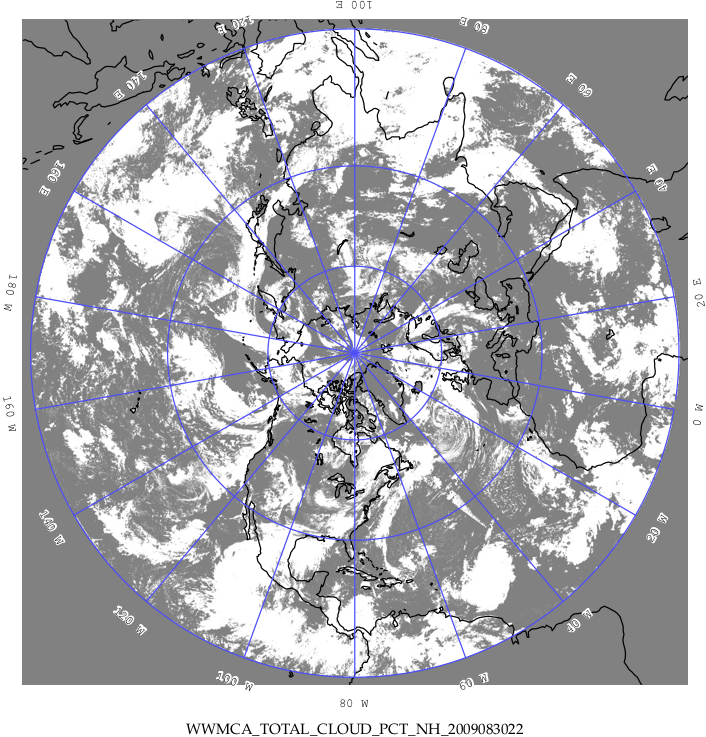

.. _appendixE:

Appendix E WWMCA Tools
======================

There are two WWMCA tools available. The WWMCA-Plot tool makes a PostScript plot of one or more WWMCA cloud percent files and the WWMCA-Regrid tool regrids WWMCA cloud percent files and reformats them into netCDF files that the other MET tools can read.

The WWMCA tools get valid time and hemisphere (north or south) information from the file names, so it's important for both of the WWMCA tools that these file names not be changed.

____________________

The usage statement for wwmca_plot is

.. code-block:: none

  wwmca_plot [ -outdir path ] wwmca_cloud_pct_file_list

Here, **wwmca_cloud_pct_file_list** represents one or more WWMCA cloud percent files given on the command line. As with any command given to a UNIX shell, the user can use meta-characters as a shorthand way to specify many filenames.

The optional **-outdir** argument specifies a directory where the output PostScript plots will be placed. If not specified, then the plots will be put in the current (working) directory. :numref:`reformat_grid_fig2` shows an example of the wwmca_plot output.

.. _reformat_grid_fig2:

	    Example output of WWMCA-Plot tool.

The usage statement for wwmca_regrid is

.. code-block:: none

  wwmca_regrid -out filename config filename [ -nh filename ] [ -sh filename ]

Here, the **-out** switch tells wwmca_regrid what to name the output netCDF file. The **-config** switch gives the name of the config file that wwmca_regrid should use—like many of the MET tools, wwmca-regrid uses a configuration file to specify user-changeable parameters. The format of this file will be explained below.

The **-nh** and **-sh** options give names of WWMCA cloud percent files that wwmca_regrid should use as input. Northern hemisphere files are specified with **-nh**, and southern hemisphere files with **-sh**. At least one of these must be given, but in many cases both need not be given.

In any regridding problem, there are two grids involved: the “From” grid, which is the grid the input data are on, and the “To” grid, which is the grid the data are to be moved onto. For wwmca_regrid, the “To” grid is specified in the config file. If this grid is entirely confined to one hemisphere, then only the WWMCA data file for that hemisphere needs to be given. It’s only when the “To” grid straddles the equator that data files for both hemispheres need to be given (though the interpolation width parameter in the config file can change this—see below). Once the “To” grid is specified in the config file, the WWMCA-Regrid tool will know which input data files it needs, and will complain if it’s not given the right ones.

Now let’s talk about the details of the config file. The config file has the same C-like syntax that all the other MET config files use. The first (and most complicated) thing to specify is the “To” grid. This is given by the **to_grid** parameter. If you are using one of the standard NCEP grids, for example grid #218, you can simply write

.. code-block:: none

  To grid = "G218";

and that will work. Failing that, you must give the parameters that specify the grid and it’s projection. Four projections are supported: Lambert Conformal, Polar Stereographic, Plate Carrée, and Mercator.

To specify a Lambert Grid, the syntax is

.. code-block:: none

  lambert Nx Ny lat_ll lon_ll lon_orient D_km R_km standard_lat_1 [ standard_lat_2 ] N|S

Here, **Nx** and **Ny** are the number of points in, respectively, the **x** and **y** grid directions. These two numbers give the overall size of the grid. **lat_ll** and **lon_ll** are the latitude and longitude, in degrees, of the lower left point of the grid. North latitude and east longitude are considered positive. **lon_orient** is the orientation longitude of the grid. It’s the meridian of longitude that’s parallel to one of the vertical grid directions. **D_km** and **R_km** are the grid resolution and the radius of the Earth, both in kilometers. **standard_lat_1** and **standard_lat_2** are the standard parallels of the Lambert projection. If the two latitudes are the same, then only one needs to be given. **N|S** means to write either **N** or **S** depending on whether the Lambert projection is from the north pole or the south pole.

As an example of specifying a Lambert grid, suppose you have a northern hemisphere Lambert grid with 614 points in the x direction and 428 points in the y direction. The lower left corner of the grid is at latitude :math:`12.190^\circ` north and longitude :math:`133.459^\circ` west. The orientation longitude is :math:`95^\circ` west. The grid spacing is :math:`12.19058^\circ` km. The radius of the Earth is the default value used in many grib files: 6367.47 km. Both standard parallels are at :math:`25^\circ` north. To specify this grid in the config file, you would write

.. code-block:: none
		
  To grid = "lambert 614 428 12.190 -133.459 -95.0 12.19058 6367.47 25.0 N";

For a Polar Stereographic grid, the syntax is

.. code-block:: none
		
  Nx Ny lat_ll lon_ll lon_orient D_km R_km lat_scale N|S

Here, **Nx, Ny, lat_ll, lon_ll, lon_orient, D_km** and **R_km** have the same meaning as in the Lambert case. **lat_scale** is the latitude where the grid scale **D_km** is true, while **N|S** means to write either **N** or **S** depending on whether the stereographic projection is from the north pole or the south pole.

For Plate Carrée grids, the syntax is

.. code-block:: none

  latlon Nx Ny lat_ll lon_ll delta_lat delta_lon

The parameters **Nx, Ny, lat_ll** and **lon_ll** are as before. **delta_lat** and **delta_lon** are the latitude and longitude increments of the grid—i.e., the change in latitude or longitude between one grid point and an adjacent grid point.

For a Mercator grid, the syntax is

.. code-block:: none
		
  mercator Nx Ny lat_ll lon_ll lat_ur lon_ur

The parameters **Nx, Ny, lat_ll** and **lon_ll** are again as before, while **lat_ur** and **lon_ur** are the latitude and longitude of the upper right corner of the grid.

Thankfully, the rest of the parameters in the config file are easier to specify.

The next two config file parameters have to do with specifying the interpolation scheme used. The **interp_method** parameter specifies which interpolation method is to be used. Four methods are supported: average, maximum, minimum and nearest neighbor. As an example, to specify the “average” method, one would write

.. code-block:: none

  interp_method = "average";

The other interpolation parameter is **interp_width**. This specifies the width of the interpolation box used in the above interpolation method. An example value could be

.. code-block:: none
		
  interp_width = 5;

The value must be odd and ≥ 1. If a value of 1 is specified, then nearest neighbor interpolation will be used regardless of the value assigned to **interp_method**.

The fact that an interpolation box is used has one subtle implication—the “To” grid is effectively fattened by half the width of the interpolation box. This means that even for a “To” grid that is entirely contained in one hemisphere, if it comes close to the equator, this virtual fattening may be enough to push it over the equator, and the user will then have to provide input WWMCA files for both hemispheres, even though the “To” grid doesn’t cross the equator. The WWMCA-Regrid tool should detect this situation and complain to the user if not given the correct input files.

The next variable, **good_percent**, tells what fraction of the values in the interpolation square needs to be “good” in order for the interpolation scheme to return a “good” result. Example:

.. code-block:: none
		
  good percent = 0;

The rest of the config file parameters have to do with how the output netCDF file represents the data. These should be self-explanatory, so I’ll just give an example:

.. code-block:: none
		
  variable_name = "Cloud Pct";
  long_name     = "cloud cover percent";
  grib_code     = 100;
  units         = "percent";
  level         = "SFC"; 
