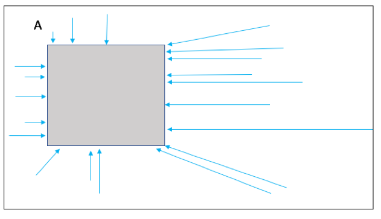
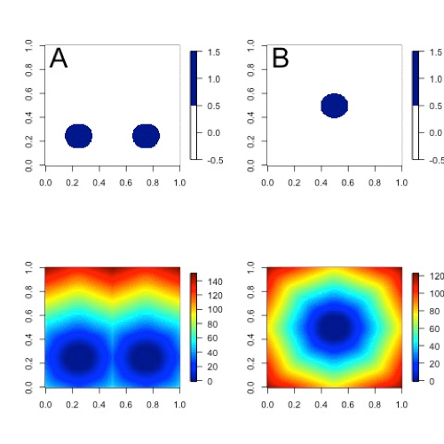

.. _grid-stat:

Grid-Stat Tool
==============

Introduction
____________

The Grid-Stat tool provides verification statistics for a matched forecast and observation grid. All of the forecast grid points in the region of interest are matched to observation grid points on the same grid. All the matched grid points are used to compute the verification statistics. The Grid-Stat tool functions in much the same way as the Point-Stat tool, except that no interpolation is required because the forecasts and observations are on the same grid. However, the interpolation parameters may be used to perform a smoothing operation on the forecast and observation fields prior to verification. In addition to traditional verification approaches, the Grid-Stat tool includes Fourier decompositions, gradient statistics, distance metrics, and neighborhood methods, designed to examine forecast performance as a function of spatial scale.

Scientific and statistical aspects of the Grid-Stat tool are briefly described in this section, followed by practical details regarding usage and output from the tool.

Scientific and statistical aspects
__________________________________

Statistical measures
~~~~~~~~~~~~~~~~~~~~

The Grid-Stat tool computes a wide variety of verification statistics. Broadly speaking, these statistics can be subdivided into three types of statistics: measures for categorical variables, measures for continuous variables, and measures for probabilistic forecasts. Further, when a climatology file is included, reference statistics for the forecasts compared to the climatology can be calculated. These categories of measures are briefly described here; specific descriptions of all measures are provided in :numref:`Appendix C, Section %s <appendixC>`. Additional information can be found in :ref:`Wilks (2011) <Wilks-2011>` and :ref:`Jolliffe and Stephenson (2012) <Jolliffe-2012>`, and on the Collaboration for Australian Weather and Climate Research Forecast Verification - `Issues, Methods and FAQ web page <http://www.cawcr.gov.au/projects/verification/verif_web_page.html>`_.

In addition to these verification measures, the Grid-Stat tool also computes partial sums and other FHO statistics that are produced by the NCEP verification system. These statistics are also described in :numref:`Appendix C, Section %s <appendixC>`.

Measures for categorical variables
^^^^^^^^^^^^^^^^^^^^^^^^^^^^^^^^^^

Categorical verification statistics are used to evaluate forecasts that are in the form of a discrete set of categories rather than on a continuous scale. Grid-Stat computes both 2x2 and multi-category contingency tables and their associated statistics, similar to Point-Stat. See :numref:`Appendix C, Section %s <appendixC>` for more information.

Measures for continuous variables
^^^^^^^^^^^^^^^^^^^^^^^^^^^^^^^^^

For continuous variables, many verification measures are based on the forecast error (i.e., f - o). However, it also is of interest to investigate characteristics of the forecasts, and the observations, as well as their relationship. These concepts are consistent with the general framework for verification outlined by :ref:`Murphy and Winkler (1987) <Murphy-1987>`. The statistics produced by MET for continuous forecasts represent this philosophy of verification, which focuses on a variety of aspects of performance rather than a single measure. See :numref:`Appendix C, Section %s <appendixC>` for specific information.

A user may wish to eliminate certain values of the forecasts from the calculation of statistics, a process referred to here as “conditional verification”. For example, a user may eliminate all temperatures above freezing and then calculate the error statistics only for those forecasts of below freezing temperatures. Another common example involves verification of wind forecasts. Since wind direction is indeterminate at very low wind speeds, the user may wish to set a minimum wind speed threshold prior to calculating error statistics for wind direction. The user may specify these thresholds in the configuration file to specify the conditional verification. Thresholds can be specified using the usual Fortran conventions (<, <=, ==, !-, >=, or >) followed by a numeric value. The threshold type may also be specified using two letter abbreviations (lt, le, eq, ne, ge, gt). Further, more complex thresholds can be achieved by defining multiple thresholds and using && or || to string together event definition logic. The forecast and observation threshold can be used together according to user preference by specifying one of: UNION, INTERSECTION, or SYMDIFF (symmetric difference).

Measures for probabilistic forecasts and dichotomous outcomes
^^^^^^^^^^^^^^^^^^^^^^^^^^^^^^^^^^^^^^^^^^^^^^^^^^^^^^^^^^^^^

For probabilistic forecasts, many verification measures are based on reliability, accuracy and bias. However, it also is of interest to investigate joint and conditional distributions of the forecasts and the observations, as in :ref:`Wilks (2011) <Wilks-2011>`. See :numref:`Appendix C, Section %s <appendixC>` for specific information.

Probabilistic forecast values are assumed to have a range of either 0 to 1 or 0 to 100. If the max data value is > 1, we assume the data range is 0 to 100, and divide all the values by 100. If the max data value is <= 1, then we use the values as is. Further, thresholds are applied to the probabilities with equality on the lower end. For example, with a forecast probability p, and thresholds t1 and t2, the range is defined as: t1 <= p < t2. The exception is for the highest set of thresholds, when the range includes 1: t1 <= p <= 1. To make configuration easier, since METv6.0, these probabilities may be specified in the configuration file as a list (>0.00,>0.25,>0.50,>0.75,>1.00) or using shorthand notation (==0.25) for bins of equal width.

Since METv6.0, when the "prob" entry is set as a dictionary to define the field of interest, setting "prob_as_scalar = TRUE" indicates that this data should be processed as regular scalars rather than probabilities.For example, this option can be used to compute traditional 2x2 contingency tables and neighborhood verification statistics for probability data. It can also be used to compare two probability fields directly.

Use of a climatology field for comparative verification
^^^^^^^^^^^^^^^^^^^^^^^^^^^^^^^^^^^^^^^^^^^^^^^^^^^^^^^

The Grid-Stat tool allows evaluation of model forecasts compared with a user-supplied climatology. Prior to calculation of statistics, the climatology must be put on the same grid as the forecasts and observations. In particular, the anomaly correlation and mean squared error skill score provide a measure of the forecast skill versus the climatology. For more details about climatological comparisons and reference forecasts, see the relevant section in the Point-Stat Chapter: :numref:`Climatology`.

Use of analysis fields for verification
^^^^^^^^^^^^^^^^^^^^^^^^^^^^^^^^^^^^^^^

The Grid-Stat tool allows evaluation of model forecasts using model analysis fields. However, users are cautioned that an analysis field is not independent of its parent model; for this reason verification of model output using an analysis field from the same model is generally not recommended and is not likely to yield meaningful information about model performance.

Statistical confidence intervals
~~~~~~~~~~~~~~~~~~~~~~~~~~~~~~~~

The confidence intervals for the Grid-Stat tool are the same as those provided for the Point-Stat tool except that the scores are based on pairing grid points with grid points so that there are likely more values for each field making any assumptions based on the central limit theorem more likely to be valid. However, it should be noted that spatial (and temporal) correlations are not presently taken into account in the confidence interval calculations. Therefore, confidence intervals reported may be somewhat too narrow (e.g., :ref:`Efron 2007 <Efron-2007>`). See :numref:`Appendix D, Section %s <appendixD>` for details regarding confidence intervals provided by MET.

Grid weighting
~~~~~~~~~~~~~~

When computing continuous statistics on a regular large scale or global latitude-longitude grid, weighting may be applied in order to compensate for the meridian convergence toward higher latitudes. Grid square area weighting or weighting based on the cosine of the latitude are two configuration options in both point-stat and grid-stat. See :numref:`Data IO MET Configuration File Options` for more information.

Neighborhood methods
~~~~~~~~~~~~~~~~~~~~

MET also incorporates several neighborhood methods to give credit to forecasts that are close to the observations, but not necessarily exactly matched up in space. Also referred to as “fuzzy” verification methods, these methods do not just compare a single forecast at each grid point to a single observation at each grid point; they compare the forecasts and observations in a neighborhood surrounding the point of interest. With the neighborhood method, the user chooses a distance within which the forecast event can fall from the observed event and still be considered a hit. In MET this is implemented by defining a square search window around each grid point. Within the search window, the number of observed events is compared to the number of forecast events. In this way, credit is given to forecasts that are close to the observations without requiring a strict match between forecasted events and observed events at any particular grid point. The neighborhood methods allow the user to see how forecast skill varies with neighborhood size and can help determine the smallest neighborhood size that can be used to give sufficiently accurate forecasts.

There are several ways to present the results of the neighborhood approaches, such as the Fractions Skill Score (FSS) or the Fractions Brier Score (FBS). These scores are presented in :numref:`Appendix C, Section %s <appendixC>`. One can also simply up-scale the information on the forecast verification grid by smoothing or resampling within a specified neighborhood around each grid point and recalculate the traditional verification metrics on the coarser grid. The MET output includes traditional contingency table statistics for each threshold and neighborhood window size.

The user must specify several parameters in the grid_stat configuration file to utilize the neighborhood approach, such as the interpolation method, size of the smoothing window, and required fraction of valid data points within the smoothing window. For FSS-specific results, the user must specify the size of the neighborhood window, the required fraction of valid data points within the window, and the fractional coverage threshold from which the contingency tables are defined. These parameters are described further in the practical information section below.

Fourier Decomposition
~~~~~~~~~~~~~~~~~~~~~

The MET software will compute the full one-dimensional Fourier transform, then do a partial inverse transform based on the two user-defined wave numbers. These two wave numbers define a band pass filter in the Fourier domain. This process is conceptually similar to the operation of projecting onto subspace in linear algebra. If one were to sum up all possible wave numbers the result would be to simply reproduce the raw data.

Decomposition via Fourier transform allows the user to evaluate the model separately at each spatial frequency. As an example, the Fourier analysis allows users to examine the "dieoff", or reduction, in anomaly correlation of geopotential height at various levels for bands of waves. A band of low wave numbers, say 0 - 3, represent larger frequency components, while a band of higher wave numbers, for example 70 - 72, represent smaller frequency components. Generally, anomaly correlation should be higher for frequencies with low wave numbers than for frequencies with high wave numbers, hence the "dieoff".

Wavelets, and in particular the MET wavelet tool, can also be used to define a band pass filter (:ref:`Casati et al, 2004 <Casati-2004>`; :ref:`Weniger et al 2016 <Weniger-2016>`). Both the Fourier and wavelet methods can be used to look at different spatial scales.

Gradient Statistics
~~~~~~~~~~~~~~~~~~~

The S1 score has been in historical use for verification of forecasts, particularly for variables such as pressure and geopotential height. This score compares differences between adjacent grid points in the forecast and observed fields. When the adjacent points in both forecast and observed fields exhibit the same differences, the S1 score will be the perfect value of 0. Larger differences will result in a larger score.

Differences are computed in both of the horizontal grid directions and is not a true mathematical gradient. Because the S1 score focuses on differences only, any bias in the forecast will not be measured. Further, the score depends on the domain and spacing of the grid, so can only be compared on forecasts with identical grids.

Distance Maps
~~~~~~~~~~~~~

The following methods can all be computed efficiently by utilizing fast algorithms developed for calculating distance maps. A distance map results from calculating the shortest distance from every grid point, :math:`s=(x,y)`, in the domain, :math:`D`, to the nearest one-valued grid point. In each of the following, it is understood that they are calculated between event areas :math:`A`, from one field and observation event areas :math:`B` from another. If the measure is applied to a feature within a field, then the distance map is still calculated over the entire original domain. Some of the distance map statistics are computed over the entire distance map, while others use only parts of it.

Because these methods rely on the distance map, it is helpful to understand precisely what such maps do. :numref:`grid-stat_fig1` demonstrates the path of the shortest distance to the nearest event point in the event area A marked by the gray rectangle in the diagram. Note that the arrows all point to a grid point on the boundary of the event area A as it would be a longer distance to any point in its interior. :numref:`grid-stat_fig2` demonstrates the shortest distances from every grid point inside a second event area marked by the gray circle labeled B to the same event area A as in :numref:`grid-stat_fig1`. Note that all of the distances are to points on a small subsection (indicated by the yellow stretch) of the subset A.

.. _grid-stat_fig1:

   The above diagram depicts how a distance map is formed. From every grid point in the domain (depicted by the larger rectangle), the shortest distance from that grid to the nearest non-zero grid point (event; depicted by the gray rectangle labeled as A) is calculated (a sample of grid points with arrows indicate the path of the shortest distance with the length of the arrow equal to this distance. In a distance map, the value at each grid point is this distance. For example, grid points within the rectangle A will all have value zero in the distance map.

.. _grid-stat_fig2:

.. figure:: figure/grid-stat_fig2.png

   Diagram depicting the shortest distances from one event area to another. The yellow bar indicates the part of the event area A to where all of the shortest distances from B are calculated. That is, the shortest distances from every point inside the set B to the set A all point to a point along the yellow bar.

While :numref:`grid-stat_fig1` and :numref:`grid-stat_fig2` are helpful in illustrating the idea of a distance map, :numref:`grid-stat_fig3` shows an actual distance map calculated for binary fields consisting of circular event areas, where one field has two circular event areas labeled A, and the second has one circular event area labeled B. Notice that the values of the distance map inside the event areas are all zero (dark blue) and the distances grow larger in the pattern of concentric circles around these event areas as grid cells move further away. Finally, :numref:`grid-stat_fig4` depicts special situations from which the distance map measures to be discussed are calculated. In particular, the top left panel shows the absolute difference between the two distance maps presented in the bottom row of :numref:`grid-stat_fig3`. The top right panel shows the portion of the distance map for A that falls within the event area of B, and the bottom left depicts the portion of the distance map for B that falls within the event area A. That is, the first shows the shortest distances from every grid point in the set B to the nearest grid point in the event area A, and the latter shows the shortest distance from every grid point in A to the nearest grid point in B.

.. _grid-stat_fig3:

   Binary fields (top) with event areas A (consisting of two circular event areas) and a second field with event area B (single circular area) with their respective distance maps (bottom).

.. _grid-stat_fig4:

.. figure:: figure/grid-stat_fig4.png

   The absolute difference between the distance maps in the bottom row of :numref:`grid-stat_fig3` (top left), the shortest distances from every grid point in B to the nearest grid point in A (top right), and the shortest distances from every grid point in A to the nearest grid points in B (bottom left). The latter two do not have axes in order to emphasize that the distances are now only considered from within the respective event sets. The top right graphic is the distance map of A conditioned on the presence of an event from B, and that in the bottom left is the distance map of B conditioned on the presence of an event from A.

The statistics derived from these distance maps are described in :numref:`Appendix C, Section %s <App_C-distance_maps>`. For each combination of input field and categorical threshold requested in the configuration file, Grid-Stat applies that threshold to define events in the forecast and observation fields and computes distance maps for those binary fields. Statistics for all requested masking regions are derived from those distance maps. Note that the distance maps are computed only once over the full verification domain, not separately for each masking region. Events occurring outside of a masking region can affect the distance map values inside that masking region and, therefore, can also affect the distance maps statistics for that region.

Practical information
_____________________

This section contains information about configuring and running the Grid-Stat tool. The Grid-Stat tool verifies gridded model data using gridded observations. The input gridded model and observation datasets must be in one of the MET supported file formats. The requirement of having all gridded fields using the same grid specification was removed in METv5.1. There is a regrid option in the configuration file that allows the user to define the grid upon which the scores will be computed. The gridded observation data may be a gridded analysis based on observations such as Stage II or Stage IV data for verifying accumulated precipitation, or a model analysis field may be used.

The Grid-Stat tool provides the capability of verifying one or more model variables/levels using multiple thresholds for each model variable/level. The Grid-Stat tool performs no interpolation when the input model, observation, and climatology datasets must be on a common grid. MET will interpolate these files to a common grid if one is specified. The interpolation parameters may be used to perform a smoothing operation on the forecast field prior to verifying it to investigate how the scale of the forecast affects the verification statistics. The Grid-Stat tool computes a number of continuous statistics for the forecast minus observation differences, discrete statistics once the data have been thresholded, or statistics for probabilistic forecasts. All types of statistics can incorporate a climatological reference.

grid_stat usage
~~~~~~~~~~~~~~~

The usage statement for the Grid-Stat tool is listed below:

.. code-block:: none

  Usage: grid_stat
         fcst_file
         obs_file
         config_file
         [-outdir path]
         [-log file]
         [-v level]
         [-compress level]

grid_stat has three required arguments and accepts several optional ones.

Required arguments for grid_stat
^^^^^^^^^^^^^^^^^^^^^^^^^^^^^^^^

1. The **fcst_file** argument indicates the gridded file containing the model data to be verified.

2. The **obs_file** argument indicates the gridded file containing the gridded observations to be used for the verification of the model.

3. The **config_file** argument indicates the name of the configuration file to be used. The contents of the configuration file are discussed below.

Optional arguments for grid_stat
^^^^^^^^^^^^^^^^^^^^^^^^^^^^^^^^

4. The **-outdir path** indicates the directory where output files should be written.

5. The **-log file** option directs output and errors to the specified log file. All messages will be written to that file as well as standard out and error. Thus, users can save the messages without having to redirect the output on the command line. The default behavior is no log file.

6. The **-v level** option indicates the desired level of verbosity. The contents of “level” will override the default setting of 2. Setting the verbosity to 0 will make the tool run with no log messages, while increasing the verbosity above 1 will increase the amount of logging.

7. The **-compress level** option indicates the desired level of compression (deflate level) for NetCDF variables. The valid level is between 0 and 9. The value of “level” will override the default setting of 0 from the configuration file or the environment variable MET_NC_COMPRESS. Setting the compression level to 0 will make no compression for the NetCDF output. Lower number is for fast compression and higher number is for better compression.

An example of the grid_stat calling sequence is listed below:

**Example 1:**

.. code-block:: none

  grid_stat sample_fcst.grb \
  sample_obs.grb \
  GridStatConfig

In Example 1, the Grid-Stat tool will verify the model data in the sample_fcst.grb GRIB file using the observations in the sample_obs.grb GRIB file applying the configuration options specified in the GridStatConfig file.

A second example of the grid_stat calling sequence is listed below:

**Example 2:**

.. code-block:: none

  grid_stat sample_fcst.nc
  sample_obs.nc
  GridStatConfig

In the second example, the Grid-Stat tool will verify the model data in the sample_fcst.nc NetCDF output of pcp_combine, using the observations in the sample_obs.nc NetCDF output of pcp_combine, and applying the configuration options specified in the GridStatConfig file. Because the model and observation files contain only a single field of accumulated precipitation, the GridStatConfig file should be configured to specify that only accumulated precipitation be verified.

.. _grid_stat-configuration-file:

grid_stat configuration file
~~~~~~~~~~~~~~~~~~~~~~~~~~~~

The default configuration file for the Grid-Stat tool, named GridStatConfig_default, can be found in the installed *share/met/config* directory. Other versions of the configuration file are included in *scripts/config*. We recommend that users make a copy of the default (or other) configuration file prior to modifying it. The contents are described in more detail below.

Note that environment variables may be used when editing configuration files, as described in :numref:`pb2nc configuration file` for the PB2NC tool.

__________________________

.. code-block:: none

  model          = "WRF";
  desc           = "NA";
  obtype         = "ANALYS"; 
  fcst           = { ... }
  obs            = { ... }
  regrid         = { ... }
  climo_mean     = { ... }
  climo_stdev    = { ... }
  climo_cdf      = { ... }
  mask           = { grid = [ "FULL" ]; poly = []; }
  ci_alpha       = [ 0.05 ];
  boot           = { interval = PCTILE; rep_prop = 1.0; n_rep = 1000;
                     rng = "mt19937"; seed = ""; }
  interp         = { field = BOTH; vld_thresh = 1.0; shape = SQUARE;
                     type = [ { method = NEAREST; width = 1; } ]; }
  censor_thresh  = [];
  censor_val     = [];
  eclv_points    = 0.05;
  rank_corr_flag = TRUE;
  tmp_dir        = "/tmp";
  output_prefix  = "";
  version        = "VN.N";

The configuration options listed above are common to many MET tools and are described in :numref:`Data IO MET Configuration File Options`.

___________________________

.. code-block:: none

  nbrhd = {
     field      = BOTH;
     vld_thresh = 1.0;
     shape      = SQUARE;
     width      = [ 1 ];
     cov_thresh = [ >=0.5 ];
   }

	 
The **nbrhd** dictionary contains a list of values to be used in defining the neighborhood to be used when computing neighborhood verification statistics. The neighborhood **shape** is a **SQUARE** or **CIRCLE** centered on the current point, and the **width** value specifies the width of the square or diameter of the circle as an odd integer.

The **field** entry is set to **BOTH, FCST, OBS**, or **NONE** to indicate the fields to which the fractional coverage derivation logic should be applied. This should always be set to **BOTH** unless you have already computed the fractional coverage field(s) with numbers between 0 and 1 outside of MET.

The **vld_thresh** entry contains a number between 0 and 1. When performing neighborhood verification over some neighborhood of points the ratio of the number of valid data points to the total number of points in the neighborhood is computed. If that ratio is greater than this threshold, that value is included in the neighborhood verification. Setting this threshold to 1, which is the default, requires that the entire neighborhood must contain valid data. This variable will typically come into play only along the boundaries of the verification region chosen.

The **cov_thresh** entry contains a comma separated list of thresholds to be applied to the neighborhood coverage field. The coverage is the proportion of forecast points in the neighborhood that exceed the forecast threshold. For example, if 10 of the 25 forecast grid points contain values larger than a threshold of 2, then the coverage is 10/25 = 0.4. If the coverage threshold is set to 0.5, then this neighborhood is considered to be a “No” forecast.

___________________

.. code-block:: none

  fourier = {
     wave_1d_beg = [ 0, 4, 10 ];
     wave_1d_end = [ 3, 9, 20 ];
  }

The **fourier** entry is a dictionary which specifies the application of the Fourier decomposition method. It consists of two arrays of the same length which define the beginning and ending wave numbers to be included. If the arrays have length zero, no Fourier decomposition is applied. For each array entry, the requested Fourier decomposition is applied to the forecast and observation fields. The beginning and ending wave numbers are indicated in the MET ASCII output files by the INTERP_MTHD column (e.g. WV1_0-3 for waves 0 to 3 or WV1_10 for only wave 10). This 1-dimensional Fourier decomposition is computed along the Y-dimension only (i.e. the columns of data). It is applied to the forecast and observation fields as well as the climatological mean field, if specified. It is only defined when each grid point contains valid data. If any input field contains missing data, no Fourier decomposition is computed. The available wave numbers start at 0 (the mean across each row of data) and end at (Nx+1)/2 (the finest level of detail), where Nx is the X-dimension of the verification grid.

The **wave_1d_beg** entry is an array of integers specifying the first wave number to be included. The **wave_1d_end** entry is an array of integers specifying the last wave number to be included.

_____________________

.. code-block:: none

  grad = {
     dx = [ 1 ];
     dy = [ 1 ];
   }

The **gradient** entry is a dictionary which specifies the number and size of gradients to be computed. The **dx** and **dy** entries specify the size of the gradients in grid units in the X and Y dimensions, respectively. **dx** and **dy** are arrays of integers (positive or negative) which must have the same length, and the GRAD output line type will be computed separately for each entry. When computing gradients, the value at the (x, y) grid point is replaced by the value at the (x+dx, y+dy) grid point minus the value at (x, y). This configuration option may be set separately in each **obs.field** entry.

____________________

.. code-block:: none

  distance_map = {
     baddeley_p        = 2;
     baddeley_max_dist = NA;
     fom_alpha         = 0.1;
     zhu_weight        = 0.5;
  }

The **distance_map** entry is a dictionary containing options related to the distance map statistics in the **DMAP** output line type. The **baddeley_p** entry is an integer specifying the exponent used in the Lp-norm when computing the Baddeley :math:`\Delta` metric. The **baddeley_max_dist** entry is a floating point number specifying the maximum allowable distance for each distance map. Any distances larger than this number will be reset to this constant. A value of **NA** indicates that no maximum distance value should be used. The **fom_alpha** entry is a floating point number specifying the scaling constant to be used when computing Pratt's Figure of Merit. The **zhu_weight** specifies a value between 0 and 1 to define the importance of the RMSE of the binary fields (i.e. amount of overlap) versus the mean-error distance (MED). The default value of 0.5 gives equal weighting. This configuration option may be set separately in each **obs.field** entry.

_____________________

.. code-block:: none

  output_flag = {
     fho    = BOTH;
     ctc    = BOTH;
     cts    = BOTH;
     mctc   = BOTH;
     mcts   = BOTH;
     cnt    = BOTH;
     sl1l2  = BOTH;
     sal1l2 = NONE;
     vl1l2  = BOTH;
     val1l2 = NONE;
     vcnt   = BOTH;
     pct    = BOTH;
     pstd   = BOTH;
     pjc    = BOTH;
     prc    = BOTH;
     eclv   = BOTH;
     nbrctc = BOTH;
     nbrcts = BOTH;
     nbrcnt = BOTH;
     grad   = BOTH;
     dmap   = BOTH;
  }

The **output_flag** array controls the type of output that the Grid-Stat tool generates. Each flag corresponds to an output line type in the STAT file. Setting the flag to NONE indicates that the line type should not be generated. Setting the flag to STAT indicates that the line type should be written to the STAT file only. Setting the flag to BOTH indicates that the line type should be written to the STAT file as well as a separate ASCII file where the data are grouped by line type. These output flags correspond to the following types of output line types:

1. **FHO** for Forecast, Hit, Observation Rates

2. **CTC** for Contingency Table Counts

3. **CTS** for Contingency Table Statistics

4. **MCTC** for Multi-Category Contingency Table Counts

5. **MCTS** for Multi-Category Contingency Table Statistics

6. **CNT** for Continuous Statistics

7. **SL1L2** for Scalar L1L2 Partial Sums

8. **SAL1L2** for Scalar Anomaly L1L2 Partial Sums when climatological data is supplied

9. **VL1L2** for Vector L1L2 Partial Sums

10. **VAL1L2** for Vector Anomaly L1L2 Partial Sums when climatological data is supplied

11. **VCNT** for Vector Contingency Table Statistics

12. **PCT** for Contingency Table Counts for Probabilistic forecasts

13. **PSTD** for Contingency Table Statistics for Probabilistic forecasts

14. **PJC** for Joint and Conditional factorization for Probabilistic forecasts

15. **PRC** for Receiver Operating Characteristic for Probabilistic forecasts

16. **ECLV** for Cost/Loss Ratio Relative Value

17. **NBRCTC** for Neighborhood Contingency Table Counts

18. **NBRCTS** for Neighborhood Contingency Table Statistics

19. **NBRCNT** for Neighborhood Continuous Statistics

20. **GRAD** for Gradient Statistics

21. **DMAP** for Distance Map Statistics

Note that the first two line types are easily derived from one another. The user is free to choose which measure is most desired. The output line types are described in more detail in :numref:`grid_stat-output`.

_____________________

.. code-block:: none

  nc_pairs_flag = {
     latlon       = TRUE;
     raw          = TRUE;
     diff         = TRUE;
     climo        = TRUE;
     climo_cdp    = TRUE;
     weight       = FALSE;
     nbrhd        = FALSE;
     gradient     = FALSE;
     distance_map = FALSE;
     apply_mask   = TRUE;
  }

The **nc_pairs_flag** entry may either be set to a boolean value or a dictionary specifying which fields should be written. Setting it to TRUE indicates the output NetCDF matched pairs file should be created with all available output fields, while setting all to FALSE disables its creation. This is done regardless of if **output_flag** dictionary indicates any statistics should be computed. The **latlon, raw**, and **diff** entries control the creation of output variables for the latitude and longitude, the raw forecast and observed fields, and the forecast minus observation difference fields. The **climo, weight**, and **nbrhd** entries control the creation of output variables for the climatological mean and standard deviation fields, the grid area weights applied, and the fractional coverage fields computed for neighborhood verification methods. Setting these entries to TRUE indicates that they should be written, while setting them to FALSE disables their creation.

Setting the **climo_cdp** entry to TRUE enables the creation of an output variable for each climatological distribution percentile (CDP) threshold requested in the configuration file. Note that enabling **nbrhd** output may lead to very large output files. The **gradient** entry controls the creation of output variables for the FCST and OBS gradients in the grid-x and grid-y directions. The **distance_map** entry controls the creation of output variables for the FCST and OBS distance maps for each categorical threshold. The **apply_mask** entry controls whether to create the FCST, OBS, and DIFF output variables for all defined masking regions. Setting this to TRUE will create the FCST, OBS, and DIFF output variables for all defined masking regions. Setting this to FALSE will create the FCST, OBS, and DIFF output variables for only the FULL verification domain.

______________________

.. code-block:: none

  nc_pairs_var_name = "";

The **nc_pairs_var_name** entry specifies a string for each verification task. This string is parsed from each **obs.field** dictionary entry and is used to construct variable names for the NetCDF matched pairs output file. The default value of an empty string indicates that the **name** and **level** strings of the input data should be used. If the input data **level** string changes for each run of Grid-Stat, using this option to define a constant string may make downstream processing more convenient.

_____________________

.. code-block:: none

  nc_pairs_var_suffix = "";

The **nc_pairs_var_suffix** entry is similar to the **nc_pairs_var_name** entry. It is also parsed from each **obs.field** dictionary entry. However, it defines a suffix to be appended to the output variable name. This enables the output variable names to be made unique. For example, when verifying height for multiple level types but all with the same level value, use this option to customize the output variable names. This option was previously named **nc_pairs_var_str** which is now deprecated.

.. _grid_stat-output:

grid_stat output
~~~~~~~~~~~~~~~~

grid_stat produces output in STAT and, optionally, ASCII and NetCDF formats. The ASCII output duplicates the STAT output but has the data organized by line type. The output files are written to the default output directory or the directory specified by the -outdir command line option.

The output STAT file is named using the following naming convention:

grid_stat_PREFIX_HHMMSSL_YYYYMMDD_HHMMSSV.stat where PREFIX indicates the user-defined output prefix, HHMMSSL indicates the forecast lead time and YYYYMMDD_HHMMSSV indicates the forecast valid time.

The output ASCII files are named similarly:

grid_stat_PREFIX_HHMMSSL_YYYYMMDD_HHMMSSV_TYPE.txt where TYPE is one of fho, ctc, cts, mctc, mcts, cnt, sl1l2, vl1l2, vcnt, pct, pstd, pjc, prc, eclv, nbrctc, nbrcts, nbrcnt, dmap, or grad to indicate the line type it contains.

The format of the STAT and ASCII output of the Grid-Stat tool are the same as the format of the STAT and ASCII output of the Point-Stat tool with the exception of the five additional line types. Please refer to the tables in :numref:`point_stat-output` for a description of the common output STAT and optional ASCII file line types. The formats of the five additional line types for grid_stat are explained in the following tables.

.. _table_GS_header_info_gs_outputs:

.. list-table:: Header information for each file grid-stat outputs
  :widths: auto
  :header-rows: 2

  * - HEADER
    - 
    - 
  * - Column Number
    - Header Column Name
    - Description
  * - 1
    - VERSION
    - Version number
  * - 2
    - MODEL
    - User provided text string designating model name
  * - 3
    - DESC
    - User provided text string describing the verification task
  * - 4
    - FCST_LEAD
    - Forecast lead time in HHMMSS format
  * - 5
    - FCST_VALID_BEG
    - Forecast valid start time in YYYYMMDD_HHMMSS format
  * - 6
    - FCST_VALID_END
    - Forecast valid end time in YYYYMMDD_HHMMSS format
  * - 7
    - OBS_LEAD
    - Observation lead time in HHMMSS format
  * - 8
    - OBS_VALID_BEG
    - Observation valid start time in YYYYMMDD_HHMMSS format
  * - 9
    - OBS_VALID_END
    - Observation valid end time in YYYYMMDD_HHMMSS format
  * - 10
    - FCST_VAR
    - Model variable
  * - 11
    - FCST_UNITS
    - Units for model variable
  * - 12
    - FCST_LEV
    - Selected Vertical level for forecast
  * - 13
    - OBS_VAR
    - Observation variable
  * - 14
    - OBS_UNITS
    - Units for observation variable
  * - 15
    - OBS_LEV
    - Selected Vertical level for observations
  * - 16
    - OBTYPE
    - User provided text string designating the observation type
  * - 17
    - VX_MASK
    - Verifying masking region indicating the masking grid or polyline region applied
  * - 18
    - INTERP_MTHD
    - Interpolation method applied to forecast field
  * - 19
    - INTERP_PNTS
    - Number of points used by interpolation method
  * - 20
    - FCST_THRESH
    - The threshold applied to the forecast
  * - 21
    - OBS_THRESH
    - The threshold applied to the observations
  * - 22
    - COV_THRESH
    - Proportion of observations in specified neighborhood which must exceed obs_thresh
  * - 23
    - ALPHA
    - Error percent value used in confidence intervals
  * - 24
    - LINE_TYPE
    - Various line type options, refer to :numref:`point_stat-output` and the tables below.

.. _table_GS_format_info_NBRCTC:

.. list-table:: Format information for NBRCTC (Neighborhood Contingency Table Counts) output line type
  :widths: auto
  :header-rows: 2

  * - NBRCTC OUTPUT FORMAT
    - 
    - 
  * - Column Number
    - NBRCTC Column Name
    - Description
  * - 24
    - NBRCTC
    - Neighborhood Contingency Table Counts line type
  * - 25
    - TOTAL
    - Total number of matched pairs
  * - 26
    - FY_OY
    - Number of forecast yes and observation yes
  * - 27
    - FY_ON
    - Number of forecast yes and observation no
  * - 28
    - FN_OY
    - Number of forecast no and observation yes
  * - 29
    - FN_ON
    - Number of forecast no and observation no

.. role:: raw-html(raw)
    :format: html

.. _table_GS_format_info_NBRCTS:

.. list-table:: Format information for NBRCTS (Neighborhood Contingency Table Statistics) output line type
  :widths: auto
  :header-rows: 2

  * - NBRCTS OUTPUT FORMAT
    - 
    - 
  * - Column Number
    - NBRCTS Column Name
    - Description
  * - 24
    - NBRCTS
    - Neighborhood Contingency Table Statistics line type
  * - 25
    - TOTAL
    - Total number of matched pairs
  * - 26-30
    - BASER, :raw-html:` ` BASER_NCL, :raw-html:` ` BASER_NCU, :raw-html:` ` BASER_BCL, :raw-html:` ` BASER_BCU
    - Base rate including normal and bootstrap upper and lower confidence limits
  * - 31-35
    - FMEAN, :raw-html:` ` FMEAN_NCL, :raw-html:` ` FMEAN_NCU, :raw-html:` ` FMEAN_BCL, :raw-html:` ` FMEAN_BCU
    - Forecast mean including normal and bootstrap upper and lower confidence limits
  * - 36-40
    - ACC, :raw-html:` ` ACC_NCL, :raw-html:` ` ACC_NCU, :raw-html:` ` ACC_BCL, :raw-html:` ` ACC_BCU
    - Accuracy including normal and bootstrap upper and lower confidence limits
  * - 41-43
    - FBIAS, :raw-html:` ` FBIAS_BCL, :raw-html:` ` FBIAS_BCU
    - Frequency Bias including bootstrap upper and lower confidence limits
  * - 44-48
    - PODY, :raw-html:` ` PODY_NCL, :raw-html:` ` PODY_NCU, :raw-html:` ` PODY_BCL, :raw-html:` ` PODY_BCU
    - Probability of detecting yes including normal and bootstrap upper and lower confidence limits
  * - 49-53
    - PODN, :raw-html:` ` PODN_NCL, :raw-html:` ` PODN_NCU, :raw-html:` ` PODN_BCL, :raw-html:` ` PODN_BCU
    - Probability of detecting no including normal and bootstrap upper and lower confidence limits
  * - 54-58
    - POFD, :raw-html:` ` POFD_NCL, :raw-html:` ` POFD_NCU, :raw-html:` ` POFD_BCL, :raw-html:` ` POFD_BCU
    - Probability of false detection including normal and bootstrap upper and lower confidence limits
  * - 59-63
    - FAR, :raw-html:` ` FAR_NCL, :raw-html:` ` FAR_NCU, :raw-html:` ` FAR_BCL, :raw-html:` ` FAR_BCU
    - False alarm ratio including normal and bootstrap upper and lower confidence limits
  * - 64-68
    - CSI, :raw-html:` ` CSI_NCL, :raw-html:` ` CSI_NCU, :raw-html:` ` CSI_BCL, :raw-html:` ` CSI_BCU
    - Critical Success Index including normal and bootstrap upper and lower confidence limits
  * - 69-71
    - GSS, :raw-html:` ` GSS_BCL, :raw-html:` ` GSS_BCU
    - Gilbert Skill Score including bootstrap upper and lower confidence limits

.. _table_GS_format_info_NBRCTS_cont:
      
.. role:: raw-html(raw)
    :format: html

.. list-table:: Format information for NBRCTS (Neighborhood Contingency Table Statistics) output line type, continued from above
  :widths: auto
  :header-rows: 1

  * - Column Number
    - NBRCTS Column Name
    - Description
  * - 72-76
    - HK, :raw-html:` ` HK_NCL, :raw-html:` ` HK_NCU, :raw-html:` ` HK_BCL, :raw-html:` ` HK_BCU
    - Hanssen-Kuipers Discriminant including normal and bootstrap upper and lower confidence limits
  * - 77-79
    - HSS, :raw-html:` ` HSS_BCL, :raw-html:` ` HSS_BCU
    - Heidke Skill Score including bootstrap upper and lower confidence limits
  * - 80-84
    - ODDS, :raw-html:` ` ODDS_NCL, :raw-html:` ` ODDS_NCU, :raw-html:` ` ODDS_BCL, :raw-html:` ` ODDS_BCU
    - Odds Ratio including normal and bootstrap upper and lower confidence limits
  * - 85-89
    - LODDS, :raw-html:` ` LODDS_NCL, :raw-html:` ` LODDS_NCU, :raw-html:` ` LODDS_BCL, :raw-html:` ` LODDS_BCU
    - Logarithm of the Odds Ratio including normal and bootstrap upper and lower confidence limits
  * - 90-94
    - ORSS, :raw-html:` ` ORSS _NCL, :raw-html:` ` ORSS _NCU, :raw-html:` ` ORSS _BCL, :raw-html:` ` ORSS _BCU
    - Odds Ratio Skill Score including normal and bootstrap upper and lower confidence limits
  * - 95-99
    - EDS, :raw-html:` ` EDS _NCL, :raw-html:` ` EDS _NCU, :raw-html:` ` EDS _BCL, :raw-html:` ` EDS _BCU
    - Extreme Dependency Score including normal and bootstrap upper and lower confidence limits
  * - 100-104
    - SEDS, :raw-html:` ` SEDS _NCL, :raw-html:` ` SEDS _NCU, :raw-html:` ` SEDS _BCL SEDS _BCU
    - Symmetric Extreme Dependency Score including normal and bootstrap upper and lower confidence limits
  * - 105-109
    - EDI, :raw-html:` ` EDI _NCL, :raw-html:` ` EDI _NCU, :raw-html:` ` EDI _BCL, :raw-html:` ` EDI _BCU
    - Extreme Dependency Index including normal and bootstrap upper and lower confidence limits
  * - 110-114
    - SEDI, :raw-html:` ` SEDI _NCL, :raw-html:` ` SEDI _NCU, :raw-html:` ` SEDI _BCL,SEDI _BCU
    - Symmetric Extremal Dependency Index including normal and bootstrap upper and lower confidence limits
  * - 115-117
    - BAGSS, :raw-html:` ` BAGSS_BCL, :raw-html:` ` BAGSS_BCU
    - Bias Adjusted Gilbert Skill Score including bootstrap upper and lower confidence limits

.. role:: raw-html(raw)
    :format: html

.. _table_GS_format_info_NBRCNT:
	     
.. list-table:: Format information for NBRCNT(Neighborhood Continuous Statistics) output line type
  :widths: auto
  :header-rows: 2

  * - NBRCNT OUTPUT FORMAT
    - 
    - 
  * - Column Number
    - NBRCNT Column Name
    - Description
  * - 24
    - NBRCNT
    - Neighborhood Continuous statistics line type
  * - 25
    - TOTAL
    - Total number of matched pairs
  * - 26-28
    - FBS, :raw-html:` ` FBS_BCL, :raw-html:` ` FBS_BCU
    - Fractions Brier Score including bootstrap upper and lower confidence limits
  * - 29-31
    - FSS, :raw-html:` ` FSS_BCL, :raw-html:` ` FSS_BCU
    - Fractions Skill Score including bootstrap upper and lower confidence limits
  * - 32-34
    - AFSS, :raw-html:` ` AFSS_BCL, :raw-html:` ` AFSS_BCU
    - Asymptotic Fractions Skill Score including bootstrap upper and lower confidence limits
  * - 35-37
    - UFSS, :raw-html:` ` UFSS_BCL, :raw-html:` ` UFSS_BCU
    - Uniform Fractions Skill Score including bootstrap upper and lower confidence limits
  * - 38-40
    - F_RATE, :raw-html:` ` F_RATE _BCL, :raw-html:` ` F_RATE _BCU
    - Forecast event frequency including bootstrap upper and lower confidence limits
  * - 41-43
    - O_RATE, :raw-html:` ` O _RATE _BCL, :raw-html:` ` O _RATE _BCU
    - Observed event frequency including bootstrap upper and lower confidence limits

.. _table_GS_format_info_GRAD:

.. list-table:: Format information for GRAD (Gradient Statistics) output line type
  :widths: auto
  :header-rows: 2

  * - GRAD OUTPUT FORMAT
    - 
    - 
  * - Column Number
    - GRAD Column Name
    - Description
  * - 24
    - GRAD
    - Gradient Statistics line type
  * - 25
    - TOTAL
    - Total number of matched pairs
  * - 26
    - FGBAR
    - Mean of absolute value of forecast gradients
  * - 27
    - OGBAR
    - Mean of absolute value of observed gradients
  * - 28
    - MGBAR
    - Mean of maximum of absolute values of forecast and observed gradients
  * - 29
    - EGBAR
    - Mean of absolute value of forecast minus observed gradients
  * - 30
    - S1
    - S1 score
  * - 31
    - S1_OG
    - S1 score with respect to observed gradient
  * - 32
    - FGOG_RATIO
    - Ratio of forecast and observed gradients
  * - 33
    - DX
    - Gradient size in the X-direction
  * - 34
    - DY
    - Gradient size in the Y-direction

.. _table_GS_format_info_DMAP:

.. list-table:: Format information for DMAP (Distance Map) output line type
  :widths: auto
  :header-rows: 2

  * - DMAP OUTPUT FORMAT
    - 
    - 
  * - Column Number
    - DMAP Column Name
    - Description
  * - 24
    - DMAP
    - Distance Map line type
  * - 25
    - TOTAL
    - Total number of matched pairs
  * - 26
    - FY
    - Number of forecast events
  * - 27
    - OY
    - Number of observation events
  * - 28
    - FBIAS
    - Frequency Bias
  * - 29
    - BADDELEY
    - Baddeley's :math:`\Delta` Metric
  * - 30
    - HAUSDORFF
    - Hausdorff Distance
  * - 31
    - MED_FO
    - Mean-error Distance from observation to forecast
  * - 32
    - MED_OF
    - Mean-error Distance from forecast to observation
  * - 33
    - MED_MIN
    - Minimum of MED_FO and MED_OF
  * - 34
    - MED_MAX
    - Maximum of MED_FO and MED_OF
  * - 35
    - MED_MEAN
    - Mean of MED_FO and MED_OF
  * - 36
    - FOM_FO
    - Pratt's Figure of Merit from observation to forecast
  * - 37
    - FOM_OF
    - Pratt's Figure of Merit from forecast to observation
  * - 38
    - FOM_MIN
    - Minimum of FOM_FO and FOM_OF
  * - 39
    - FOM_MAX
    - Maximum of FOM_FO and FOM_OF
  * - 40
    - FOM_MEAN
    - Mean of FOM_FO and FOM_OF
  * - 41
    - ZHU_FO
    - Zhu's Measure from observation to forecast
  * - 42
    - ZHU_OF
    - Zhu's Measure from forecast to observation
  * - 43
    - ZHU_MIN
    - Minimum of ZHU_FO and ZHU_OF
  * - 44
    - ZHU_MAX
    - Maximum of ZHU_FO and ZHU_OF
  * - 45
    - ZHU_MEAN
    - Mean of ZHU_FO and ZHU_OF

If requested using the **nc_pairs_flag** dictionary in the configuration file, a NetCDF file containing the matched pair and forecast minus observation difference fields for each combination of variable type/level and masking region applied will be generated. The contents of this file are determined by the contents of the nc_pairs_flag dictionary. The output NetCDF file is named similarly to the other output files: **grid_stat_PREFIX_ HHMMSSL_YYYYMMDD_HHMMSSV_pairs.nc**. Commonly available NetCDF utilities such as ncdump or ncview may be used to view the contents of the output file.

The output NetCDF file contains the dimensions and variables shown in :numref:`table_GS_Dimensions_NetCDF_matched_pair_out` and :numref:`table_GS_var_NetCDF_matched_pair_out`.

.. _table_GS_Dimensions_NetCDF_matched_pair_out:

.. list-table:: Dimensions defined in NetCDF matched pair output
  :widths: auto
  :header-rows: 2

  * - grid_stat NETCDF DIMENSIONS
    -
  * - NetCDF Dimension
    - Description
  * - Lat
    - Dimension of the latitude (i.e. Number of grid points in the North-South direction)
  * - Lon
    - Dimension of the longitude (i.e. Number of grid points in the East-West direction)

      
.. role:: raw-html(raw)
    :format: html
	     
.. _table_GS_var_NetCDF_matched_pair_out:

.. list-table:: A selection of variables that can appear in the NetCDF matched pair output
  :widths: auto
  :header-rows: 2

  * - grid_stat NETCDF VARIABLES
    - 
    - 
  * - NetCDF Variable
    - Dimension
    - Description
  * - FCST_VAR_LVL_MASK  _INTERP_MTHD  _INTERP_PNTS
    - lat, lon
    - For each model variable (VAR), vertical level (LVL), masking region (MASK), and, if applicable, smoothing operation (INTERP_MTHD and INTERP_PNTS), the forecast value is listed for each point in the mask.
  * - OBS_VAR_LVL_MASK  DIFF_FCSTVAR
    - lat, lon
    - For each model variable (VAR), vertical level (LVL), and masking region (MASK), the observation value is listed for each point in the mask .
  * - DIFF_FCSTVAR :raw-html:` ` _FCSTLVL :raw-html:` ` _OBSVAR :raw-html:` ` _OBSLVL_MASK :raw-html:` ` _INTERP_MTHD :raw-html:` ` _INTERP_PNTS
    - lat, lon
    - For each model variable (VAR), vertical level (LVL), masking region (MASK), and, if applicable, smoothing operation (INTERP_MTHD and INTERP_PNTS), the difference (forecast - observation) is computed for each point in the mask.
  * - FCST_XGRAD_DX  FCST_YGRAD_DX  OBS_XGRAD_DY  OBS_YGRAD_DY
    - lat, lon
    - List the gradient of the forecast and observation fields computed in the grid-x and grid-y directions where DX and DY indicate the gradient direction and size.

The STAT output files described for grid_stat may be used as inputs to the Stat-Analysis tool. For more information on using the Stat-Analysis tool to create stratifications and aggregations of the STAT files produced by grid_stat, please see :numref:`stat-analysis`. 
