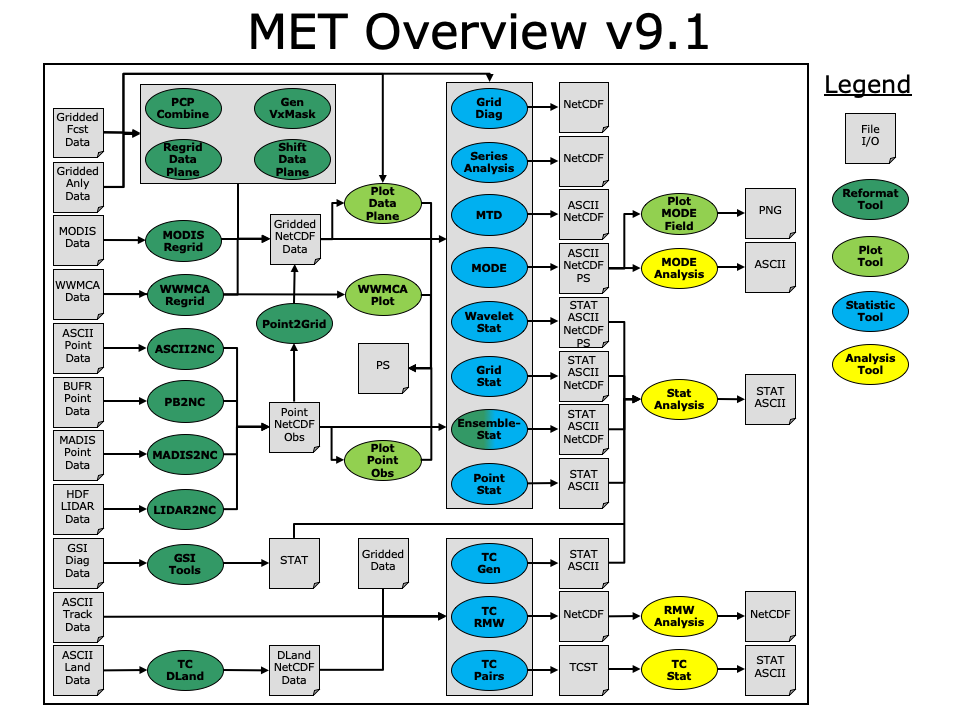

.. _overview:

Overview of MET
===============

Purpose and organization of the User's Guide
____________________________________________

The goal of this User's Guide is to provide basic information for users of the Model Evaluation Tools (MET) to enable them to apply MET to their datasets and evaluation studies. MET was originally designed for application to the post-processed output of the `Weather Research and Forecasting (WRF) <https://www.mmm.ucar.edu/weather-research-and-forecasting-model>`_ model. However, MET may also be used for the evaluation of forecasts from other models or applications, including the `Unified Forecast System (UFS) <http://www.ufscommunity.org>`_, and the `System for Integrated Modeling of the Atmosphere (SIMA) <https://wiki.ucar.edu/display/SIMA/>`_ if certain file format definitions (described in this document) are followed.

The MET User's Guide is organized as follows. :numref:`overview` provides an overview of MET and its components. :numref:`installation` contains basic information about how to get started with MET - including system requirements, required software (and how to obtain it), how to download MET, and information about compilers, libraries, and how to build the code. :numref:`data_io` - :numref:`masking` focuses on the data needed to run MET, including formats for forecasts, observations, and output. These sections also document the reformatting and masking tools available in MET. :numref:`point-stat` - :numref:`gsi_tools` focuses on the main statistics modules contained in MET, including the Point-Stat, Grid-Stat, Ensemble-Stat, Wavelet-Stat and GSI Diagnostic Tools. These sections include an introduction to the statistical verification methodologies utilized by the tools, followed by a section containing practical information, such as how to set up configuration files and the format of the output. :numref:`stat-analysis` and :numref:`series-analysis` focus on the analysis modules, Stat-Analysis and Series-Analysis, which aggregate the output statistics from the other tools across multiple cases. :numref:`mode` - :numref:`mode-td` describes a suite of object-based tools, including MODE, MODE-Analysis, and MODE-TD. :numref:`met-tc_overview` - :numref:`rmw-analysis` describes tools focused on tropical cyclones, including MET-TC Overview, TC-Dland, TC-Pairs, TC-Stat, TC-Gen, TC-RMW and RMW-Analysis. Finally, :numref:`plotting`  includes plotting tools included in the MET release for checking and visualizing data, as well as some additional tools and information for plotting MET results. The appendices provide further useful information, including answers to some typical questions  (:numref:`Appendix A, Section %s <appendixA>`) and links and information about map projections, grids, and polylines (:numref:`Appendix B, Section %s <appendixB>`). :numref:`Appendix C, Section %s <appendixC>` and :numref:`Appendix D, Section %s <appendixD>` provide more information about the verification measures and confidence intervals that are provided by MET. Sample code that can be used to perform analyses on the output of MET and create particular types of plots of verification results is posted on the `MET website <https://dtcenter.org/community-code/model-evaluation-tools-met>`_). Note that the MET development group also accepts contributed analysis and plotting scripts which may be posted on the MET website for use by the community. It should be noted there are References (:numref:`refs`) in this User's Guide as well.

The remainder of this section includes information about the context for MET development, as well as information on the design principles used in developing MET. In addition, this section includes an overview of the MET package and its specific modules.

The Developmental Testbed Center (DTC)
______________________________________

MET has been developed, and will be maintained and enhanced, by the `Developmental Testbed Center (DTC) <http://www.dtcenter.org/>`_. The main goal of the DTC is to serve as a bridge between operations and research, to facilitate the activities of these two important components of the numerical weather prediction (NWP) community. The DTC provides an environment that is functionally equivalent to the operational environment in which the research community can test model enhancements; the operational community benefits from DTC testing and evaluation of models before new models are implemented operationally. MET serves both the research and operational communities in this way - offering capabilities for researchers to test their own enhancements to models and providing a capability for the DTC to evaluate the strengths and weaknesses of advances in NWP prior to operational implementation.

The MET package is available to DTC staff, visitors, and collaborators, as well as both the US and International modeling community, for testing and evaluation of new model capabilities, applications in new environments, and so on.  It is also the core component of the unified METplus verification framework.  METplus details can be found on the `METplus webpage <http://dtcenter.org/community-code/metplus>`_.

.. _MET-goals:

MET goals and design philosophy
_______________________________

The primary goal of MET development is to provide a state-of-the-art verification package to the NWP community. By "state-of-the-art" we mean that MET will incorporate newly developed and advanced verification methodologies, including new methods for diagnostic and spatial verification and new techniques provided by the verification and modeling communities. MET also utilizes and replicates the capabilities of existing systems for verification of NWP forecasts. For example, the MET package replicates existing National Center for Environmental Prediction (NCEP) operational verification capabilities (e.g., I/O, methods, statistics, data types). MET development will take into account the needs of the NWP community - including operational centers and the research and development community. Some of the MET capabilities include traditional verification approaches for standard surface and upper air variables (e.g., Equitable Threat Score, Mean Squared Error), confidence intervals for verification measures, and spatial forecast verification methods. In the future, MET will include additional state-of-the-art and new methodologies.

The MET package has been designed to be modular and adaptable. For example, individual modules can be applied without running the entire set of tools. New tools can easily be added to the MET package due to this modular design. In addition, the tools can readily be incorporated into a larger "system" that may include a database as well as more sophisticated input/output and user interfaces. Currently, the MET package is a set of tools that can easily be applied by any user on their own computer platform. A suite of Python scripts for low-level automation of verification workflows and plotting has been developed to assist users with setting up their MET-based verification. It is called METplus and may be obtained on the `METplus GitHub repository <https://github.com/dtcenter/METplus>`_.

The MET code and documentation is maintained by the DTC in Boulder, Colorado. The MET package is freely available to the modeling, verification, and operational communities, including universities, governments, the private sector, and operational modeling and prediction centers.

MET components
______________

The major components of the MET package are represented in :numref:`overview-figure`. The main stages represented are input, reformatting, plotting, intermediate output, statistical analyses, and output and aggregation/analysis. The MET-TC package functions independently of the other MET modules, as indicated in the Figure. Each of these stages is described further in later sections. For example, the input and output formats are discussed in :numref:`data_io` as well as in the sections associated with each of the statistics modules. MET input files are represented on the far left.

The reformatting stage of MET consists of the Gen-Vx-Mask, PB2NC, ASCII2NC, Pcp-Combine, MADIS2NC, MODIS regrid, WWMCA Regrid, and Ensemble-Stat tools. The PB2NC tool is used to create NetCDF files from input PrepBUFR files containing point observations. Likewise, the ASCII2NC tool is used to create NetCDF files from input ASCII point observations. Many types of data from the MADIS network can be formatted for use in MET by the MADIS2NC tool. MODIS and WWMCA files are regridded and formatted into NetCDF files by their respective tools. These NetCDF files are then used in the statistical analysis step. The Gen-Vx-Mask and Pcp-Combine tools are optional. The Gen-Vx-Mask tool will create a bitmapped masking area in a variety of ways. The output mask can then be used to efficiently limit verification to the interior of a user specified region. The Pcp-Combine tool can be used to add, subtract, or derive fields across multiple time steps. Often it is run to accumulate precipitation amounts into the time interval selected by the user - if a user would like to verify over a different time interval than is included in their forecast or observational dataset. The Ensemble-Stat tool will combine many forecasts into an ensemble mean or probability forecast. Additionally, if gridded or point observations are included, ensemble verification statistics are produced.

.. _overview-figure:

   Basic representation of current MET structure and modules. Gray areas represent input and output files. Dark green areas represent reformatting and pre-processing tools. Light green areas represent plotting utilities. Blue areas represent statistical tools. Yellow areas represent aggregation and analysis tools.

Several optional plotting utilities are provided to assist users in checking their output from the data preprocessing step. Plot-Point-Obs creates a postscript plot showing the locations of point observations. This can be quite useful for assessing whether the latitude and longitude of observation stations was specified correctly. Plot-Data-Plane produces a similar plot for gridded data. For users of the MODE object based verification methods, the Plot-MODE-Field utility will create graphics of the MODE object output. Finally, WWMCA-Plot produces a plot of the raw WWMCA data file. 

The main statistical analysis components of the current version of MET are: Point-Stat, Grid-Stat, Series-Analysis, Ensemble-Stat, MODE, MODE-TD (MTD), Grid-Diag, and Wavelet-Stat. The Point-Stat tool is used for grid-to-point verification, or verification of a gridded forecast field against a point-based observation (i.e., surface observing stations, ACARS, rawinsondes, and other observation types that could be described as a point observation). In addition to providing traditional forecast verification scores for both continuous and categorical variables, confidence intervals are also produced using parametric and non-parametric methods. Confidence intervals take into account the uncertainty associated with verification statistics due to sampling variability and limitations in sample size. These intervals provide more meaningful information about forecast performance. For example, confidence intervals allow credible comparisons of performance between two models when a limited number of model runs is available.

Sometimes it may be useful to verify a forecast against gridded fields (e.g., Stage IV precipitation analyses). The Grid-Stat tool produces traditional verification statistics when a gridded field is used as the observational dataset. Like the Point-Stat tool, the Grid-Stat tool also produces confidence intervals. The Grid-Stat tool also includes "neighborhood" spatial methods, such as the Fractional Skill Score (:ref:`Roberts and Lean 2008 <Roberts-2008>`). These methods are discussed in :ref:`Ebert (2008) <Ebert-2008>`. The Grid-Stat tool accumulates statistics over the entire domain.

Users wishing to accumulate statistics over a time, height, or other series separately for each grid location should use the Series-Analysis tool. Series-Analysis can read any gridded matched pair data produced by the other MET tools and accumulate them, keeping each spatial location separate. Maps of these statistics can be useful for diagnosing spatial differences in forecast quality. 

Ensemble-Stat is a hybrid tool that provides based post-processing capability of the ensemble members as well as computing measures of ensemble characteristics.  Basic post-processing capability includes computing the ensemble mean, min, max, standard deviation, and ensemble relative frequency or probability.  These fields can then be used in other MET tools for additional evaluation.  The ensemble characteristics include computation of rank and probability integral transform (PIT) histograms, the end-points for receiver operator curve (ROC) and reliability diagrams, and ranked probabilities scores (RPS) and the continuous version (CRPS).

The MODE (Method for Object-based Diagnostic Evaluation) tool also uses gridded fields as observational datasets. However, unlike the Grid-Stat tool, which applies traditional forecast verification techniques, MODE applies the object-based spatial verification technique described in :ref:`Davis et al. (2006a,b) <Davis-2006>` and :ref:`Brown et al. (2007) <Brown-2007>`. This technique was developed in response to the "double penalty" problem in forecast verification. A forecast missed by even a small distance is effectively penalized twice by standard categorical verification scores: once for missing the event and a second time for producing a false alarm of the event elsewhere. As an alternative, MODE defines objects in both the forecast and observation fields. The objects in the forecast and observation fields are then matched and compared to one another. Applying this technique also provides diagnostic verification information that is difficult or even impossible to obtain using traditional verification measures. For example, the MODE tool can provide information about errors in location, size, and intensity.

The MODE-TD tool extends object-based analysis from two-dimensional forecasts and observations to include the time dimension. In addition to the two dimensional information provided by MODE, MODE-TD can be used to examine even more features including displacement in time, and duration and speed of moving areas of interest.

The Grid-Diag tools produce multivariate probability density functions (PDFs) that may be use either for exploring the relationship between two fields, or for the computation of percentiles generated from the sample for use with percentile thresholding. The output from this tool requires post-processing by METplus or user-provided utilities.

The Wavelet-Stat tool decomposes two-dimensional forecasts and observations according to the Intensity-Scale verification technique described by :ref:`Casati et al. (2004) <Casati-2004>`. There are many types of spatial verification approaches and the Intensity-Scale technique belongs to the scale-decomposition (or scale-separation) verification approaches. The spatial scale components are obtained by applying a wavelet transformation to the forecast and observation fields. The resulting scale-decomposition measures error, bias and skill of the forecast on each spatial scale. Information is provided on the scale dependency of the error and skill, on the no-skill to skill transition scale, and on the ability of the forecast to reproduce the observed scale structure. The Wavelet-Stat tool is primarily used for precipitation fields. However, the tool can be applied to other variables, such as cloud fraction.

Results from the statistical analysis stage are output in ASCII, NetCDF and Postscript formats. The Point-Stat, Grid-Stat, and Wavelet-Stat tools create STAT (statistics) files which are tabular ASCII files ending with a ".stat" suffix. In earlier versions of MET, this output format was called VSDB (Verification System DataBase). VSDB, which was developed by the NCEP, is a specialized ASCII format that can be easily read and used by graphics and analysis software. The STAT output format of the Point-Stat, Grid-Stat, and Wavelet-Stat tools is an extension of the VSDB format developed by NCEP. Additional columns of data and output line types have been added to store statistics not produced by the NCEP version.

The Stat-Analysis and MODE-Analysis tools aggregate the output statistics from the previous steps across multiple cases. The Stat-Analysis tool reads the STAT output of Point-Stat, Grid-Stat, Ensemble-Stat, and Wavelet-Stat and can be used to filter the STAT data and produce aggregated continuous and categorical statistics. The MODE-Analysis tool reads the ASCII output of the MODE tool and can be used to produce summary information about object location, size, and intensity (as well as other object characteristics) across one or more cases.

Tropical cyclone forecasts and observations are quite different than numerical model forecasts, and thus they have their own set of tools. The MET-TC package includes several modules: TC-Dland, TC-Pairs, TC-Stat, TC-Gen, TC-RMW, and RMW-Analysis. The TC-Dland module calculates the distance to land from all locations on a specified grid. This information can be used in later modules to eliminate tropical cyclones that are over land from being included in the statistics. TC-Pairs matches up tropical cyclone forecasts and observations and writes all output to a file. In TC-Stat, these forecast / observation pairs are analyzed according to user preference to produce statistics. TC-Gen evaluates the performance of Tropical Cyclone genesis forecast using contingency table counts and statistics. TC-RMW performs a coordinate transformation for gridded model or analysis fields centered on the current storm location. RMW-Analysis filters and aggregates the output of TC-RMW across multiple cases.

The following sections of this MET User's Guide contain usage statements for each tool, which may be viewed if you type the name of the tool. Alternatively, the user can also type the name of the tool followed by -help to obtain the usage statement. Each tool also has a -version command line option associated with it so that the user can determine what version of the tool they are using.

.. _release-notes:

.. include:: release-notes.rst

Future development plans
________________________

MET is an evolving verification software package. New capabilities are planned in controlled, successive version releases. Bug fixes and user-identified problems will be addressed as they are found and posted to the known issues section of the `MET User Support web page <https://dtcenter.org/community-code/model-evaluation-tools-met/user-support>`_. Plans are also in place to incorporate many new capabilities and options in future releases of MET. Please refer to the issues listed in the `MET GitHub repository <https://github.com/dtcenter/MET/issues>`_ to see our development priorities for upcoming releases.

Code support
____________

MET support is provided through a MET-help email address: met_help@ucar.edu. We will endeavor to respond to requests for help in a timely fashion. In addition, information about MET and tools that can be used with MET are provided on the `MET web page <https://dtcenter.org/community-code/model-evaluation-tools-met>`_.

We welcome comments and suggestions for improvements to MET, especially information regarding errors. Comments may be submitted using the MET Feedback form available on the MET website. In addition, comments on this document would be greatly appreciated. While we cannot promise to incorporate all suggested changes, we will certainly take all suggestions into consideration.

-help and -version command line options are available for all of the MET tools. Typing the name of the tool with no command line options also produces the usage statement.

The MET package is a "living" set of tools. Our goal is to continually enhance it and add to its capabilities. Because our time, resources, and talents are limited, we welcome contributed code for future versions of MET. These contributions may represent new verification methodologies, new analysis tools, or new plotting functions. For more information on contributing code to MET, please contact met_help@ucar.edu.

Fortify
_______

Requirements from various government agencies that use MET have resulted in our code being analyzed by Fortify, a proprietary static source code analyzer owned by HP Enterprise Security Products. Fortify analyzes source code to identify for security risks, memory leaks, uninitialized variables, and other such weaknesses and bad coding practices. Fortify categorizes any issues it finds as low priority, high priority, or critical, and reports these issues back to the developers for them to address. A development cycle is thus established, with Fortify analyzing code and reporting back to the developers, who then make changes in the source code to address these issues, and hand the new code off to Fortify again for re-analysis. The goal is to drive the counts of both high priority and critical issues down to zero.

The MET developers are pleased to report that Fortify reports zero critical issues in the MET code. Users of the MET tools who work in high security environments can rest assured about the possibility of security risks when using MET, since the quality of the code has now been vetted by unbiased third-party experts. The MET developers continue using Fortify routinely to ensure that the critical counts remain at zero and to further reduce the counts for lower priority issues.
