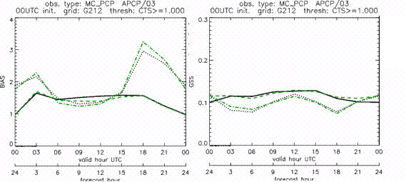

.. _plotting:

Plotting and Graphics Support
=============================

Plotting Utilities
__________________

This section describes how to check your data files using plotting utilities. Point observations can be plotted using the plot_point_obs utility. A single model level can be plotted using the plot_data_plane utility. For object based evaluations, the MODE objects can be plotted using plot_mode_field. Occasionally, a post-processing or timing error can lead to errors in MET. These tools can assist the user by showing the data to be verified to ensure that times and locations match up as expected. 

plot_point_obs usage
~~~~~~~~~~~~~~~~~~~~

The usage statement for the plot_point_obs utility is shown below:

.. code-block:: none
		
  Usage: plot_point_obs
         nc_file
         ps_file
         [-gc code]
         [-msg_typ name]
         [-data_file name]
         [-dotsize val]
         [-log file]
         [-v level]

plot_point_obs has two required arguments and can take optional ones. 

Required arguments for plot_point_obs
^^^^^^^^^^^^^^^^^^^^^^^^^^^^^^^^^^^^^

1. The **nc_file** argument indicates the name of the file to be plotted.

2. The **ps_file** argument indicates the name given to the output file containing the plot.

Optional arguments for plot_point_obs
^^^^^^^^^^^^^^^^^^^^^^^^^^^^^^^^^^^^^

3. The **-gc code** is the GRIB code(s) to be plotted.

4. The **-msg_typ name** is the message type(s) to be plotted.

5. The **-data_file name** is a data file whose grid should be used for the plot. 

6. The **-dotsize val** option overrides the default dot size value (1). 

7. The **-log file** option directs output and errors to the specified log file. All messages will be written to that file as well as standard out and error. Thus, users can save the messages without having to redirect the output on the command line. The default behavior is no logfile. 

8. The **-v level** option indicates the desired level of verbosity. The value of "level" will override the default setting of 2. Setting the verbosity to 0 will make the tool run with no log messages, while increasing the verbosity will increase the amount of logging.

An example of the plot_point_obs calling sequence is shown below:

.. code-block:: none

  plot_point_obs sample_pb.nc sample_data.ps

In this example, the plot_point_obs tool will process the input sample_pb.nc file and write a postscript file containing a plot to a file named sample_pb.ps.

.. _plot_data_plane-usage:

plot_data_plane usage
~~~~~~~~~~~~~~~~~~~~~

The usage statement for the plot_data_plane utility is shown below:

.. code-block:: none
		
  Usage: plot_data_plane
         input_filename
         output_filename
         field_string
         [-color_table color_table_name]
         [-plot_range min max]
         [-title title_string]
         [-log file]
         [-v level]

**plot_data_plane** has two required arguments and can take optional ones. 

Required arguments for plot_data_plane
^^^^^^^^^^^^^^^^^^^^^^^^^^^^^^^^^^^^^^

1. The **input_filename** argument indicates the name of the gridded data file to be plotted.

2. The **output_filename** argument indicates the name given to the output PostScript file containing the plot.

3. The **field_string** argument contains information about the field and level to be plotted.

Optional arguments for plot_data_plane
^^^^^^^^^^^^^^^^^^^^^^^^^^^^^^^^^^^^^^

4. The **-color_table color_table_name** overrides the default color table ("MET_BASE/colortables/met_default.ctable")

5. The **-plot_range min max** sets the minimum and maximum values to plot.

6. The **-title title_string** sets the title text for the plot. 

7. The **-log file** option directs output and errors to the specified log file. All messages will be written to that file as well as standard out and error. Thus, users can save the messages without having to redirect the output on the command line. The default behavior is no logfile. 

8. The **-v level** option indicates the desired level of verbosity. The value of "level" will override the default setting of 2. Setting the verbosity to 0 will make the tool run with no log messages, while increasing the verbosity will increase the amount of logging.

An example of the **plot_data_plane** calling sequence is shown below:

.. code-block:: none
		
  plot_data_plane test.grb test.ps 'name="TMP"; level="Z2";'

A second example of the **plot_data_plane** calling sequence is shown below:

.. code-block:: none
		
  plot_data_plane test.grb2 test.ps 'name="DSWRF"; level="L0";' -v 4

In the first example, the Plot-Data-Plane tool will process the input test.grb file and write a PostScript image to a file named test.ps showing temperature at 2 meters. The second example plots downward shortwave radiation flux at the surface. The second example is run at verbosity level 4 so that the user can inspect the output and make sure its plotting the intended record.

plot_mode_field usage
~~~~~~~~~~~~~~~~~~~~~

The usage statement for the **plot_mode_field** utility is shown below:

.. code-block:: none
		
  Usage: plot_mode_field
         mode_nc_file_list
         -raw | -simple | -cluster
         -obs | -fcst
         -config file
         [-log file]
         [-v level]

**plot_mode_field** has four required arguments and can take optional ones. 

Required arguments for plot_mode_field
^^^^^^^^^^^^^^^^^^^^^^^^^^^^^^^^^^^^^^

1. The **mode_nc_file_list** specifies the MODE output files to be used for plotting. 

2. The **-raw | -simple | -cluster** argument indicates the types of fields to be plotted. Exactly one must be specified. For details about the types of objects, see the section in this document on MODE.

3. The **-obs | -fcst** option specifies whether to plot the observed or forecast field from the MODE output files. Exactly one must be specified.

4. The **-config file** specifies the configuration file to use for specification of plotting options.

Optional arguments for plot_mode_field
^^^^^^^^^^^^^^^^^^^^^^^^^^^^^^^^^^^^^^

5. The **-log file** option directs output and errors to the specified log file. All messages will be written to that file as well as standard out and error. Thus, users can save the messages without having to redirect the output on the command line. The default behavior is no logfile. 

6. The **-v level** option indicates the desired level of verbosity. The value of "level" will override the default. Setting the verbosity to 0 will make the tool run with no log messages, while increasing the verbosity will increase the amount of logging.

An example of the **plot_mode_field** calling sequence is shown below:

.. code-block:: none
		
  plot_mode_field -simple -obs -config \
  plotMODEconfig mode_120000L_20050807_120000V_000000A_obj.nc

In this example, the plot_mode_field tool will plot simple objects from an observed precipitation field using parameters from the configuration file plotMODEconfig and objects from the MODE output file mode_120000L_20050807_120000V_000000A_obj.nc. An example plot showing twelve simple observed precipitation objects is shown below. 

.. _plotting_fig1:

.. figure:: figure/plotting_fig1.png
	    
   Simple observed precipitation objects

Once MET has been applied to forecast and observed fields (or observing locations), and the output has been sorted through the Analysis Tool, numerous graphical and summary analyses can be performed depending on a specific user's needs. Here we give some examples of graphics and summary scores that one might wish to compute with the given output of MET and MET-TC. Any computing language could be used for this stage; some scripts will be provided on the `MET users web page <https://dtcenter.org/community-code/model-evaluation-tools-met>`_ as examples to assist users.

Examples of plotting MET output
_______________________________

Grid-Stat tool examples
~~~~~~~~~~~~~~~~~~~~~~~

The plots in :numref:`plotting_Gilbert_skill_score` show time series of frequency bias and Gilbert Skill Score, stratified according to time of day. This type of figure is particularly useful for diagnosing problems that are tied to the diurnal cycle. In this case, two of the models (green dash-dotted and black dotted lines) show an especially high Bias (near 3) during the afternoon (15-21 UTC; left panel), while the skill (GSS; right panel) appears to be best for the models represented by the solid black line and green dashed lines in the morning (09-15 UTC). Note that any judgment of skill based on GSS should be restricted to times when the Bias is close to one. 

.. _plotting_Gilbert_skill_score:

   Time series of forecast area bias and Gilbert Skill Score for four model configurations (different lines) stratified by time-of-day.

MODE tool examples
~~~~~~~~~~~~~~~~~~

When using the MODE tool, it is possible to think of matched objects as hits and unmatched objects as false alarms or misses depending on whether the unmatched object is from the forecast or observed field, respectively. Because the objects can have greatly differing sizes, it is useful to weight the statistics by the areas, which are given in the output as numbers of grid squares. When doing this, it is possible to have different matched observed object areas from matched forecast object areas so that the number of hits will be different depending on which is chosen to be a hit. When comparing multiple forecasts to the same observed field, it is perhaps wise to always use the observed field for the hits so that there is consistency for subsequent comparisons. Defining hits, misses and false alarms in this way allows one to compute many traditional verification scores without the problem of small-scale discrepancies; the matched objects are defined as being matched because they are "close" by the fuzzy logic criteria. Note that scores involving the number of correct negatives may be more difficult to interpret as it is not clear how to define a correct negative in this context. It is also important to evaluate the number and area attributes for these objects in order to provide a more complete picture of how the forecast is performing. 

:numref:`plotting_verification` gives an example of two traditional verification scores (Bias and CSI) along with bar plots showing the total numbers of objects for the forecast and observed fields, as well as bar plots showing their total areas. These data are from the same set of 13-km WRF model runs analyzed in :numref:`plotting_verification`. The model runs were initialized at 0 UTC and cover the period 15 July to 15 August 2005. For the forecast evaluation, we compared 3-hour accumulated precipitation for lead times of 3-24 hours to Stage II radar-gauge precipitation. Note that for the 3-hr lead time, indicated as the 0300 UTC valid time in :numref:`plotting_Gilbert_skill_score`, the Bias is significantly larger than the other lead times. This is evidenced by the fact that there are both a larger number of forecast objects, and a larger area of forecast objects for this lead time, and only for this lead time. Dashed lines show about 2 bootstrap standard deviations from the estimate.

.. _plotting_verification:

.. figure:: figure/plotting_verification.gif

   Traditional verification scores applied to output of the MODE tool, computed by defining matched observed objects to be hits, unmatched observed objects to be misses, and unmatched forecast objects to be false alarms; weighted by object area. Bar plots show numbers (penultimate row) and areas (bottom row) of observed and forecast objects, respectively.

In addition to the traditional scores, MODE output allows more information to be gleaned about forecast performance. It is even useful when computing the traditional scores to understand how much the forecasts are displaced in terms of both distance and direction. :numref:`plotting_histogram`, for example, shows circle histograms for matched objects. The petals show the percentage of times the forecast object centroids are at a given angle from the observed object centroids. In :numref:`plotting_histogram` (top diagram) about 25% of the time the forecast object centroids are west of the observed object centroids, whereas in :numref:`plotting_histogram` (bottom diagram) there is less bias in terms of the forecast objects' centroid locations compared to those of the observed objects, as evidenced by the petals' relatively similar lengths, and their relatively even dispersion around the circle. The colors on the petals represent the proportion of centroid distances within each colored bin along each direction. For example, :numref:`plotting_histogram` (top row) shows that among the forecast object centroids that are located to the West of the observed object centroids, the greatest proportion of the separation distances (between the observed and forecast object centroids) is greater than 20 grid squares.

.. _plotting_histogram:

.. figure:: figure/plotting_fig4.jpg
	    
   Circle histograms showing object centroid angles and distances (see text for explanation).

.. _TC-Stat-tool-example:

TC-Stat tool example
~~~~~~~~~~~~~~~~~~~~

There is a basic R script located in the MET installation, share/met/Rscripts/plot_tcmpr.R. The usage statement with a short description of the options for *plot_tcmpr.R* can be obtained by typing: Rscript *plot_tcmpr.R* with no additional arguments. The only required argument is the *-lookin* source, which is the path to the TC-Pairs TCST output files. The R script reads directly from the TC-Pairs output, and calls TC-Stat directly for filter jobs specified in the *"-filter options"* argument.

In order to run this script, the MET_INSTALL_DIR environment variable must be set to the MET installation directory and the MET_BASE environment variable must be set to the MET_INSTALL_DIR/share/met directory. In addition, the Tc-Stat tool under MET_INSTALL_DIR/bin must be in your system path.

The supplied R script can generate a number of different plot types including boxplots, mean, median, rank, and relative performance. Pairwise differences can be plotted for the boxplots, mean, and median. Normal confidence intervals are applied to all figures unless the no_ci option is set to TRUE. Below are two example plots generated from the tools.

.. _plotting_fig5:

.. figure:: figure/plotting_fig5.jpg

   Example boxplot from plot_tcmpr.R. Track error distributions by lead time for three operational models GFNI, GHMI, HFWI.

.. _plotting_fig6:

.. figure:: figure/plotting_fig6.jpg

   Example mean intensity error with confidence intervals at 95% from plot_tcmpr.R. Raw intensity error by lead time for a homogeneous comparison of two operational models GHMI, HWFI.
